# What is Cloud Computing

- Cloud computing is on demand delivery of IT resources (compute, storage, application) through cloud services platform (AWS, Azure, GCP etc) via internet with pay as you go pricing.
- Cloud computing provides a simple way to access servers, storage, databases & set of application services over the internet.

# Why Cloud Computing

- Before cloud, companies were having their own onpremises physical datacenters.
- For those datacenters, companies needed space, physical servers, networking hardwares, resources like network engineer, OS engineer, datacenter admin, database engineer, etc. And companies have to manage all these resources on their own. In short companies needed to invest lot of money & energy to establish physical datacenters.
- With cloud, instead of buying, owning, and maintaining physical data centers and servers, we can access technology services, such as computing power, storage, and databases, on an as-needed basis from a cloud provider like Amazon Web Services (AWS).
- Here are some reasons for which companies nowadays turning to cloud computing services.
  1. **Cost**: Cloud computing eliminates capital expense of buying hardware, setting up & running on-premises datacenters.
  2. **Speed**: Most cloud computing services provides self-service & on-demand. So even large number of comuting resources are provisioned in minutes, with just some mouse clicks.
  3. **Scalability**: The benefits of cloud computing services include the ability to scale elastically. In cloud speak, that means delivering the right amount of IT resources.
  4. **Productivity**: On-premises datacenters require a lot of "racking & stacking"- hardware set-up, software patching & many other time consuming IT management chores. Cloud computing removes the need for many of these tasks. So IT teams can spend time on achieving more important business goals.
  5. **Performance**: The cloud computing services run on a worldwide network of secure datcenters, which are regularly upgraded to the latest generation of fast & efficient computing hardware. This gives several benefits over a single corporate datacenter, including reduced network latency.
  6. **Reliablity**: Cloud computing makes data backup, disaster recovery & business continuity easier & less expensive, because data can be mirrored at multiple sites on the cloud provider's network.

# Types of Cloud Computing

- Cloud computing provides developers and IT departments with the ability to focus on what matters most and avoid undifferentiated work such as procurement, maintenance, and capacity planning.
- Each type of cloud service and deployment method provides you with different levels of control, flexibility, and management.
- **Cloud Computing Models**: 1. **Infrastructure as a Service (IaaS)**: Infrastructure as a Service (IaaS) contains the basic building blocks for cloud IT and typically provides access to networking features, computers (virtual or on dedicated hardware), and data storage space. IaaS provides you with the highest level of flexibility and management control over your IT resources and is most similar to existing IT resources that many IT departments and developers are familiar with today. 2. **Platform as a Service (PaaS)**: Platform as a Service (PaaS) removes the need for your organization to manage the underlying infrastructure (usually hardware and operating systems) and allows you to focus on the deployment and management of your applications. This helps you be more efficient as you don’t need to worry about resource procurement, capacity planning, software maintenance, patching, or any of the other undifferentiated heavy lifting involved in running your application. 3. **Software as a Service (SaaS)**: Software as a Service (SaaS) provides you with a completed product that is run and managed by the service provider. In most cases, people referring to Software as a Service are referring to end-user applications. With a SaaS offering you do not have to think about how the service is maintained or how the underlying infrastructure is managed; you only need to think about how you will use that particular piece of software.
  &nbsp;<br>
  

&nbsp;<br>

- **Cloud Computing Deploying Models**:
  1. **Cloud** : A cloud-based application is fully deployed in the cloud and all parts of the application run in the cloud. Applications in the cloud have either been created in the cloud or have been migrated from an existing infrastructure to take advantage of the benefits of cloud computing.
  2. **Hybrid** : A hybrid deployment is a way to connect infrastructure and applications between cloud-based resources and existing resources that are not located in the cloud. The most common method of hybrid deployment is between the cloud and existing on-premises infrastructure to extend, and grow, an organization's infrastructure into the cloud while connecting cloud resources to the internal system.
  3. **On-premises** : The deployment of resources on-premises, using virtualization and resource management tools, is sometimes called the “private cloud”. On-premises deployment doesn’t provide many of the benefits of cloud computing but is sometimes sought for its ability to provide dedicated resources.

# Global Infrastructure

- The AWS Cloud infrastructure is built around AWS Regions and Availability Zones.
- An AWS Region is a physical location in the world where we have multiple Availability Zones.
- Availability Zones consist of one or more discrete data centers, each with redundant power, networking, and connectivity, housed in separate facilities.
- These Availability Zones offer you the ability to operate production applications and databases that are more highly available, fault tolerant, and scalable than would be possible from a single data center.
- The AWS Cloud spans 96 Availability Zones within 30 geographic regions around the world.

# Amazon EC2

- Amazon Elastic Compute Cloud (Amazon EC2) provides scalable computing capacity in the AWS Cloud.
- You can use Amazon EC2 to launch as many or as few virtual servers as you need, configure security and networking, and manage storage.
- Amazon EC2 enables you to scale up or down to handle changes in requirements or spikes in popularity, reducing your need to forecast traffic.
- Amazon EC2 provides the following features:
  - Virtual computing environments, known as instances
  - Preconfigured templates for your instances, known as Amazon Machine Images (AMIs).
  - Various configurations of CPU, memory, storage, and networking capacity for your instances, known as instance types.
  - Secure login information for your instances using key pairs
  - Temporary storage volumes
  - Persistent storage volumes for your data using Amazon Elastic Block Store (Amazon EBS), known as Amazon EBS volumes
  - Multiple physical locations for your resources, known as Regions and Availability Zones
  - A firewall that enables you to specify the protocols, ports, and source IP ranges that can reach your instances using security groups
  - Static IPv4 addresses for dynamic cloud computing, known as Elastic IP addresses
  - Metadata, known as tags, that you can create and assign to your Amazon EC2 resources
  - Virtual networks you can create that are logically isolated from the rest of the AWS Cloud, and that you can optionally connect to your own network, known as virtual private clouds(VPC).
- Steps to create Amazon EC2 instance:

  1. Login to AWS management console as a root user.
  2. We can see following screen. Select desired region. Then click on "Services" tab to browse AWS services.
     
     &nbsp;<br>
  3. Select EC2 service. On the next screen, select instances. Then following screen appears. Click on "Launch Instances"
     
     &nbsp;<br>
  4. On the next screen, we have to give desired specifications for our instance. Give any name you want, then select AMI (Amazon machine image - OS for our instance). Note- If you are using free tier account, select free tier eligible AMI.
     
     &nbsp;<br>
  5. Then select right instance type. It is nothing but the CPU & RAM configurations. Then for key-pair (required for login into instance), click on "Create new key-pair".
     
     &nbsp;<br>
  6. In network settings, select desired VPC (here, we are using AWS default VPC), then subnet (It is nothing but the availability zone. In Mumbai region, there are 3 subnets, you may select any of them or if you give no prference, AWS decides where to launch your instance), enable auto-assign public IP.
     
     &nbsp;<br>
  7. Then set firewall (security group). Click on "Create new security group". Give it a name & description. Then add rule. (Here we are creating Linux instance, so we are opening SSH port no.22 because we will remotely access our linux instance through ssh. For windows instance, you need to add RDP rule in this section). We may add more than one rule to this section. In source type there are 3 options- anywhere, custom & my ip. (If you select anywhere, it means anyone from anywhere can access your instance. With custom, we may specify any custom IP to access instance. With 'my ip', instance can only be accessed by your IP address).
     
     &nbsp;<br>
  8. Add storage. For free tier, it is providing 8Gb storage. If you want more you may increase it or you may add more volumes to it.
  9. Click on "Launch instance".
  10. Instance will get ready in few seconds. Click on "View all instances". You may see your instance running.
      
      &nbsp;<br>

- Steps to access EC2 instance with Mobaxterm:

  1.  Download & install Mobaxterm.(https://download.mobatek.net/2222022102210348/MobaXterm_Portable_v22.2.zip)
  2.  Go to AWS EC2. Slect running instance. Click on "Details". We can see here our instance has got two IPs - public IP & private IP.
      
      &nbsp;<br>
  3.  Copy public IP of the instance. Go to Mobaxterm. Click on "Session" to start new session. Then click on "SSH". Paste copied public IP in "Host" field. Login as "ec2-user". Then click on "Advanced SSH Settings". Use private key you have created. Click on "Ok".
      
      &nbsp;<br>
  4.  Now you are logged in into your instance. You can now access your instance.
      
      &nbsp;<br>

- Steps to create & access windows instance:

  1. Go to EC2 service. Click on "Launch instances". Give name to your Instance. Select windows AMI (Free tier eligible).
     
     &nbsp;<br>

  2. Select instance type (Free tier eligible). Then select previously created key-pair or create new. (Note: You may use single key-pair for maximum 500 instances.)
     
     &nbsp;<br>
  3. In network settings, as we done with linux instance, select AWS default VPC, select subnet, enable public IP.
  4. To set firewall (i.e. security group), select type RDP, because we access windows instance through rdp client port no. 3389.
     
     &nbsp;<br>

  5. Configure storage. And then click on "Launch instance".
  6. Select instance & click on "connect".
     
     &nbsp;<br>
  7. Then select RDP Client. Then "Download remote desktop file". Click on "Get password".
     
     &nbsp;<br>
  8. It opens following window. Click on "Upload private key file".
     
     &nbsp;<br>
  9. Upload key-pair we have created. Then click on "Decrypt password". Then we will get password to login into our instance. Copy that password.
     
     &nbsp;<br>
  10. Open downloaded RDP client & click on "Connect".
      
      &nbsp;<br>
  11. Then paste the copied password. Click on "OK". Then click on "Yes". You are logged into your windows instance.

- Steps to install webserver on linux instance:

  1. Go to EC2 service. Click on "Launce instances".
  2. Give name to instance. Select amazon linux AMI. Then select right instance type. Select previously created key-pair.
  3. In network settings, select AWS default VPC, subnet, enable auto assign public IP. Then in security group, we have to add "HTTP" rule, as we are deploying webserver & we will see the webpage in web browser.
     
     &nbsp;<br>
  4. Then configure storage as per your requirement. Go to Advanced details. Scroll down & you will see "User data" section at the bottom. Add following script to it.
     ```
     #!/bin/bash
     sudo su -
     yum install httpd -y
     echo "welcome to pune" >/var/www/html/index.html
     service httpd start
     chkconfig httpd on
     ```
     
     &nbsp;<br>
  5. Click on "Launch instance". Click on "View all instances". Select instance & copy it's public IP address. Paste it in browser & you will see the message.
     
     &nbsp;<br>

- **Instance Types**: Amazon EC2 provides a wide selection of instance types optimized to fit different use cases. Instance types comprise varying combinations of CPU, memory, storage, and networking capacity and give you the flexibility to choose the appropriate mix of resources for your applications. Each instance type includes one or more instance sizes, allowing you to scale your resources to the requirements of your target workload.

  1.  **General Purpose**: General purpose instances provide a balance of compute, memory and networking resources and can be used for a variety of workloads. These instances are ideal for applications that use these resources in equal proportions such as web servers and code repositories.
  2.  **Compute Optimized**: Compute Optimized instances are ideal for compute bound applications that benefit from high performance processors. Instances belonging to this family are well suited for batch processing workloads, media transcoding, high performance web servers, high performance computing (HPC), scientific modeling, dedicated gaming servers and other compute intensive applications.
  3.  **Memory Optimized**: Memory optimized instances are designed to deliver fast performance for workloads that process large data sets in memory.
  4.  **Accelerated Computing**: Accelerated computing instances use hardware accelerators, or co-processors, to perform functions, such as floating point number calculations, graphics processing, or data pattern matching, more efficiently than is possible in software running on CPUs.
  5.  **Storage Optimized**: Storage optimized instances are designed for workloads that require high, sequential read and write access to very large data sets on local storage. They are optimized to deliver tens of thousands of low-latency, random I/O operations per second (IOPS) to applications.

- **Instance purchasing options**:
  1.  On-Demand Instances: With On-Demand Instances, you pay for compute capacity by the second with no long-term commitments. You have full control over its lifecycle—you decide when to launch, stop, hibernate, start, reboot, or terminate it. We should use On-Demand Instances for applications with short-term, irregular workloads that cannot be interrupted.
  2.  Reserved Instances: Reserved Instances provide you with significant savings on your Amazon EC2 costs compared to On-Demand Instance pricing. Resrved instances give you dedicated hypervisers. You can purchase a Reserved Instance for a one-year or three-year commitment. The following payment options are available for Reserved Instances:
      - All Upfront: Full payment is made at the start of the term, with no other costs or additional hourly charges incurred for the remainder of the term, regardless of hours used.
      - Partial Upfront: A portion of the cost must be paid upfront and the remaining hours in the term are billed at a discounted hourly rate, regardless of whether the Reserved Instance is being used.
      - No Upfront: You are billed a discounted hourly rate for every hour within the term, regardless of whether the Reserved Instance is being used. No upfront payment is required.
  3.  Spot Instances: A Spot Instance is an instance that uses spare EC2 capacity that is available for less than the On-Demand price. Because Spot Instances enable you to request unused EC2 instances at steep discounts, you can lower your Amazon EC2 costs significantly. The hourly price for a Spot Instance is called a Spot price. Spot Instances are a cost-effective choice if you can be flexible about when your applications run and if your applications can be interrupted. For example, Spot Instances are well-suited for data analysis, batch jobs, background processing, and optional tasks.
  4.  Dedicated Hosts: An Amazon EC2 Dedicated Host is a physical server with EC2 instance capacity fully dedicated to your use. Dedicated Hosts allow you to use your existing per-socket, per-core, or per-VM software licenses, including Windows Server, Microsoft SQL Server, SUSE, and Linux Enterprise Server.

# Amazon EBS (Elastic Block Storage):

- Amazon Elastic Block Store (Amazon EBS) provides block level storage volumes for use with EC2 instances. EBS volumes are raw, unformatted block devices. You can mount these volumes as devices on your instances.
- EBS volumes that are attached to an instance are exposed as storage volumes that persist independently from the life of the instance. You can create a file system on top of these volumes, or use them in any way you would use a block device (such as a hard drive).
- You can dynamically change the configuration of a volume attached to an instance.
- Amazon EBS can be used for data that must be quickly accessible and requires long-term persistence. EBS volumes are particularly well-suited for use as the primary storage for file systems, databases, or for any applications that require fine granular updates and access to raw, unformatted, block-level storage.
- Amazon EBS is well suited to both database-style applications that rely on random reads and writes, and to throughput-intensive applications that perform long, continuous reads and writes.

* You can create an EBS volume in a specific Availability Zone & attach it to an instance in that same Availability Zone.
* To make a volume available outside of the Availability Zone, you can create a snapshot and restore that snapshot to a new volume anywhere in that Region. You can copy snapshots to other Regions and then restore them to new volumes there, making it easier to leverage multiple AWS Regions for geographical expansion, data center migration, and disaster recovery.
* **EBS Volume Types**:
  1.  **General Purpose SSD volumes** (gp2 and gp3) balance price and performance for a wide variety of transactional workloads. These volumes are ideal for use cases such as boot volumes, medium-size single instance databases, and development and test environments.
  2.  Provisioned IOPS SSD volumes (io1 and io2) are designed to meet the needs of I/O-intensive workloads that are sensitive to storage performance and consistency.
  3.  Throughput Optimized HDD volumes (st1) provide low-cost magnetic storage that defines performance in terms of throughput rather than IOPS. These volumes are ideal for large, sequential workloads such as Amazon EMR, ETL, data warehouses, and log processing.
  4.  Cold HDD volumes (sc1) provide low-cost magnetic storage that defines performance in terms of throughput rather than IOPS. These volumes are ideal for large, sequential, cold-data workloads. If you require infrequent access to your data and are looking to save costs, these volumes provides inexpensive block storage.
  5. Magnetic Disk

* Comparison of Volume types features: 

| Volume Type   | Minimum Size | Maximum Size | IOPS  | Throughput |
|---------------|--------------|--------------|-------|------------|
| gp1 & gp2     |    1 GB      |    16 GB     | 16000 | 250 MB     |
| io1 & io2     |    4 GB      |    16 TB     | 64000 | 1000 MB    |
|    st1        |   500 GB     |    16 TB     | 500   | 500 MB     |
|    sc1        |   500 GB     |    16 TB     | 250   | 250 MB     |
| Magnetic Disk |    1 GB      |    1 TB      | NA    | NA         |

* Steps to create EBS volume & attach to instance: 
   1. Login to AWS management console. Create one linux EC2 instance.
   2. Then go to Elastic Block Store & click on volumes.
      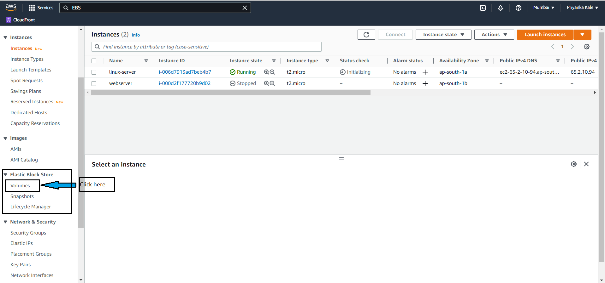
     &nbsp;<br>
   3. We may see the volume we have attached during instance creation steps. Now click on "Create Volume". Then specify required details like volume type (ssd), size (10 GB), availablility zone(same as instance), tag to the volume. Click on "Create Volume"
      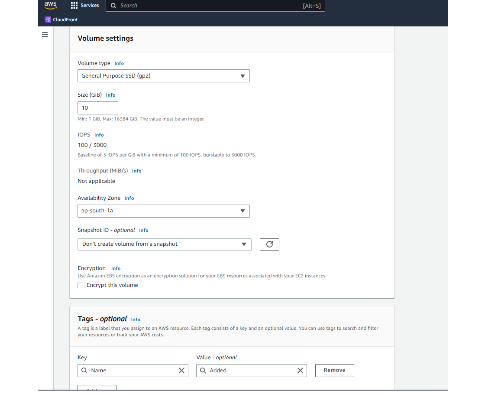
     &nbsp;<br>
   4. You may now see your added volume in volumes list. When status of volume is changed to "Available", select volume, go to "Actions", click on "Attache volume" 
      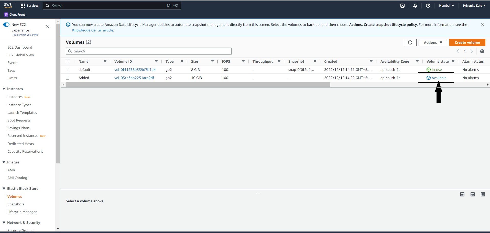
     &nbsp;<br>
     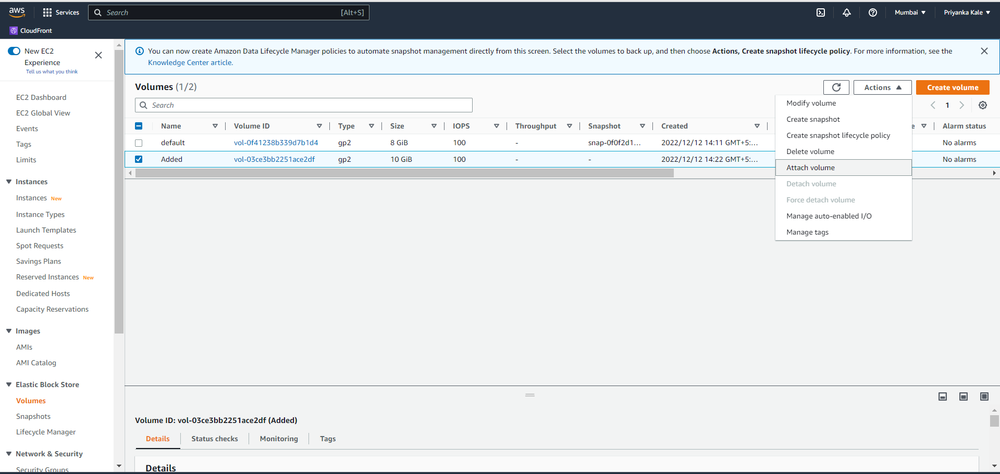
     &nbsp;<br>
   5. Select instance to which we want to attache this volume. Then click on "Attach Volume"
      
     &nbsp;<br>

   6. Login into instance using mobaxterm. Switch user to root. Then type `df -h` to see the local filesystem. It does not show our attached volume. So type `lsblk` to display details about block devices. In this list we can see our added volume.
      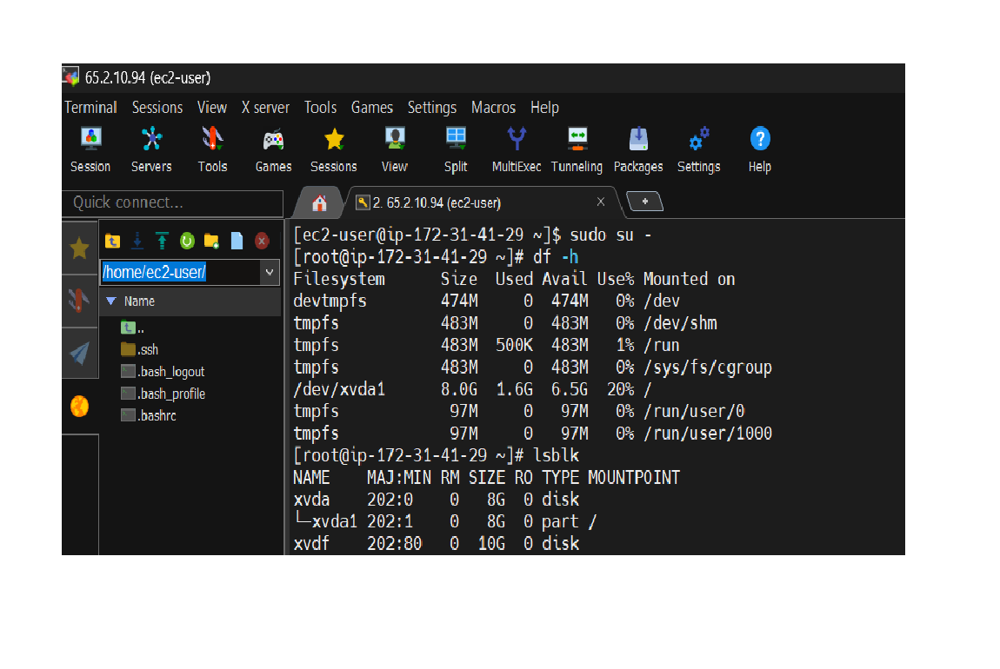
     &nbsp;<br>
   7. So we have to mount this volume block to our filesystem. For that first format the disk using `mkfs.ext4 /dev/xvdf` command. (Here "/dev/xvdf" is device name of my volume. You may use yours.) Then create one datapoint to mount this volume with `mkdir /data`. Mount volume to this datapoint using `mount /dev/xvdf /data`. Now again check local filesystem using `df -h`. You may now see our added volume in this list. 
      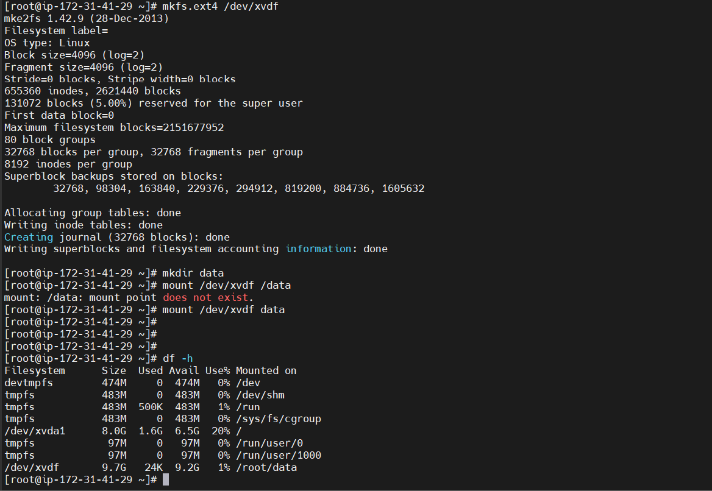
     &nbsp;<br>

# Amazon EFS: 
* Amazon Elastic File System (Amazon EFS) provides serverless, fully elastic file storage so that you can share file data without provisioning or managing storage capacity and performance.
* Amazon EFS is built to scale on demand to petabytes without disrupting applications, growing and shrinking automatically as you add and remove files.
* The service manages all the file storage infrastructure for you, meaning that you can avoid the complexity of deploying, patching, and maintaining complex file system configurations.
* You can access your Amazon EFS file system concurrently from multiple NFS clients, so applications that scale beyond a single connection can access a file system. Amazon EC2 and other AWS compute instances running in multiple Availability Zones within the same AWS Region can access the file system, so that many users can access and share a common data source.
* Amazon EFS offers a range of storage classes designed for different use cases. These include: 
   1. Standard storage classes – EFS Standard and EFS Standard–Infrequent Access (Standard–IA), which offer Multi-AZ resilience and the highest levels of durability and availability.
   2. One Zone storage classes – EFS One Zone and EFS One Zone–Infrequent Access (EFS One Zone–IA), which offer you the choice of additional savings by choosing to save your data in a single Availability Zone.

* The following image shows multiple EC2 instances accessing an Amazon EFS file system that is configured with Standard storage classes from multiple Availability Zones in an AWS Region.
   
     &nbsp;<br>
* The following image shows multiple EC2 instances accessing an Amazon EFS file system using One Zone storage from different Availability Zones in an AWS Region.
   
     &nbsp;<br>
* Steps to create EFS & access it with EC2 instance:
   1. Login to AWS management console. Search "EFS" in services. Go to EFS. Click on "Create file system".
      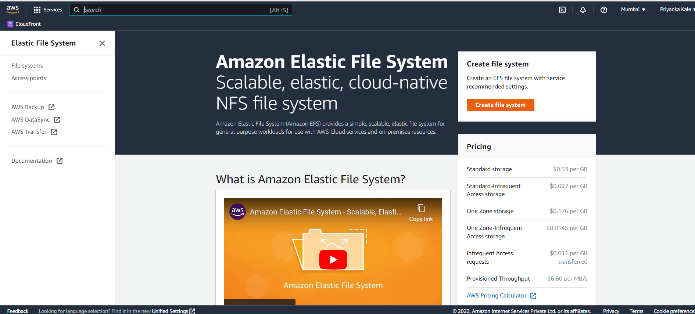
     &nbsp;<br>
   2. Fill the required details like name, select VPC (AWS default), select standard storage class. Click on "Create".
      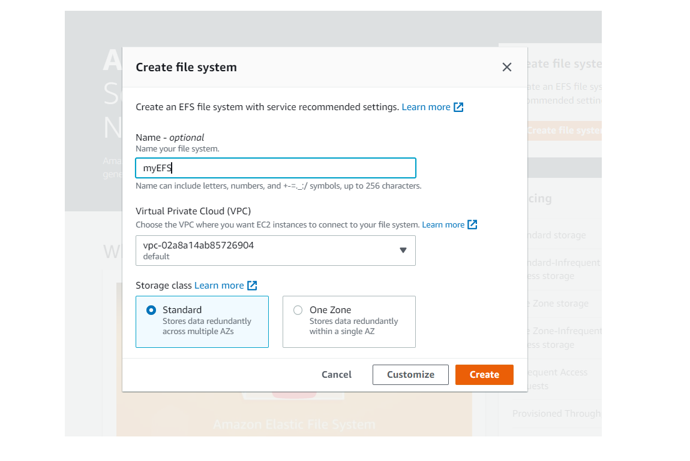
     &nbsp;<br>
   3. Go to security groups. Create new security group with inbound rule "NFS" port no. 2049 open for everyone.
       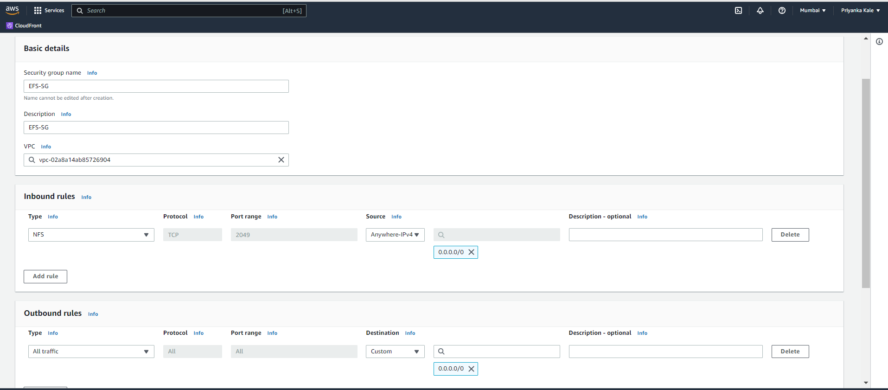
     &nbsp;<br>
   4. Go to EFS. Click on created file system. Go to "Network Tab", click on "Manage". For all Availability Zones, select newly created security group & save. 
      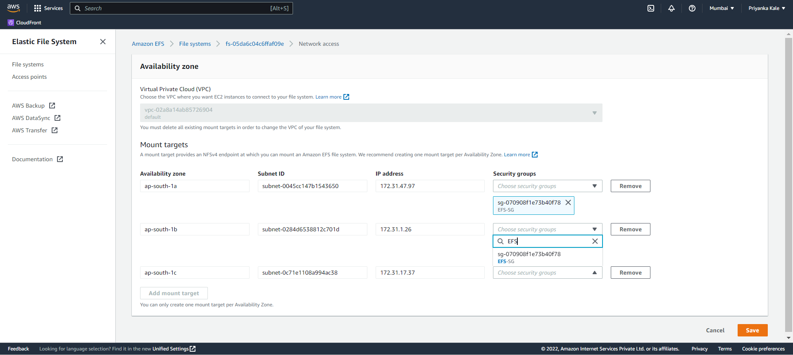
     &nbsp;<br>
   5. Create an EC2 instance with inbound rule NFS port no.2049 open for everyone. 
   6. Go to EFS. Click on created file system. Click on "Attach". Copy the last command.
      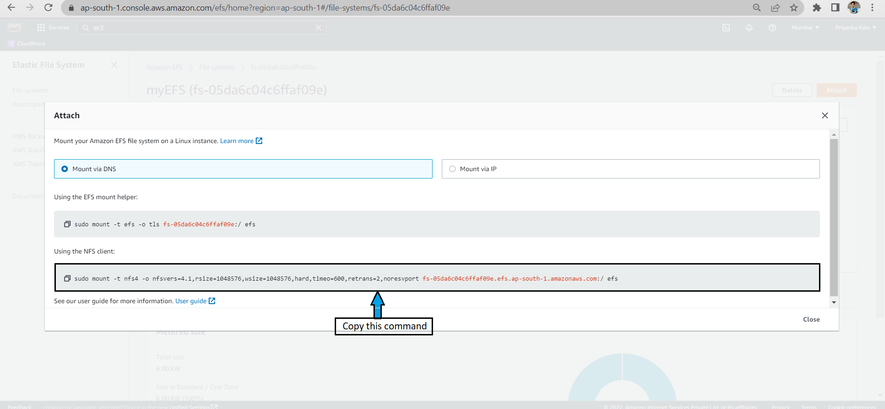
     &nbsp;<br>
   7. Access EC2 instance using MObaxterm. Create new directory "data1". Paste copied command. Instead of /efs in command type /data1 (name of mountpoint you've created). Then use `df -h` to see the local filesystem. You may see that EFS is mounted on data1. Now you may add whatever you want to this like files, folders etc. 
      
     &nbsp;<br>

# Amazon Elastic Load Balancing
* Elastic Load Balancing automatically distributes your incoming traffic across multiple targets, such as EC2 instances, containers, and IP addresses, in one or more Availability Zones.  
* It monitors the health of its registered targets, and routes traffic only to the healthy targets. Elastic Load Balancing scales your load balancer capacity automatically in response to changes in incoming traffic. 
* **Benefits of Loadbalancers**:
   - A load balancer distributes workloads across multiple compute resources, such as virtual servers. 
   - Using a load balancer increases the availability and fault tolerance of your applications.
   - You can add and remove compute resources from your load balancer as your needs change, without disrupting the overall flow of requests to your applications.
   - You can configure health checks, which monitor the health of the compute resources, so that the load balancer sends requests only to the healthy ones.
* Elastic Load Balancing supports the following load balancers: Application Load Balancers, Network Load Balancers, Gateway Load Balancers, and Classic Load Balancers. You can select the type of load balancer that best suits your needs.
   1. Classic Loadbalancers: 
      - Classic load balancer serves as a single point of contact for clients. This increases the availability of your application. You can add and remove instances from your load balancer as your needs change, without disrupting the overall flow of requests to your application. 
      - Elastic Load Balancing scales your load balancer as traffic to your application changes over time. Elastic Load Balancing can scale to the vast majority of workloads automatically.
      - A listener checks for connection requests from clients, using the protocol and port that you configure, and forwards requests to one or more registered instances using the protocol and port number that you configure. You add one or more listeners to your load balancer.
      - You can configure health checks, which are used to monitor the health of the registered instances so that the load balancer only sends requests to the healthy instances.
      - To ensure that your registered instances are able to handle the request load in each Availability Zone, it is important to keep approximately the same number of instances in each Availability Zone registered with the load balancer.
      
   2. Application Loadbalancers: 
      - An Application Load Balancer functions at the application layer, the seventh layer of the Open Systems Interconnection (OSI) model. 
      - After the load balancer receives a request, it evaluates the listener rules in priority order to determine which rule to apply, and then selects a target from the target group for the rule action. 
      - Routing is performed independently for each target group, even when a target is registered with multiple target groups. 
      - You can configure the routing algorithm used at the target group level. The default routing algorithm is round robin; alternatively, you can specify the least outstanding requests routing algorithm.

   3. Network Loadbalancers: 
      - A Network Load Balancer functions at the fourth layer of the Open Systems Interconnection (OSI) model. 
      - It can handle millions of requests per second. 
      - After the load balancer receives a connection request, it selects a target from the target group for the default rule. It attempts to open a TCP connection to the selected target on the port specified in the listener configuration.
      - For TCP traffic, the load balancer selects a target using a flow hash algorithm based on the protocol, source IP address, source port, destination IP address, destination port, and TCP sequence number. The TCP connections from a client have different source ports and sequence numbers, and can be routed to different targets. Each individual TCP connection is routed to a single target for the life of the connection.
      - For UDP traffic, the load balancer selects a target using a flow hash algorithm based on the protocol, source IP address, source port, destination IP address, and destination port. A UDP flow has the same source and destination, so it is consistently routed to a single target throughout its lifetime. Different UDP flows have different source IP addresses and ports, so they can be routed to different targets.
   
   4. Gateway Loadbalancers: 
      - Gateway Load Balancers enable you to deploy, scale, and manage virtual appliances, such as firewalls, intrusion detection and prevention systems, and deep packet inspection systems. It combines a transparent network gateway (that is, a single entry and exit point for all traffic) and distributes traffic while scaling your virtual appliances with the demand.
      - A Gateway Load Balancer operates at the third layer of the Open Systems Interconnection (OSI) model, the network layer. It listens for all IP packets across all ports and forwards traffic to the target group that's specified in the listener rule. It maintains stickiness of flows to a specific target appliance using 5-tuple (for TCP/UDP flows) or 3-tuple (for non-TCP/UDP flows).
      - The Gateway Load Balancer and its registered virtual appliance instances exchange application traffic using the GENEVE protocol on port 6081.
      - Gateway Load Balancers use Gateway Load Balancer endpoints to securely exchange traffic across VPC boundaries. A Gateway Load Balancer endpoint is a VPC endpoint that provides private connectivity between virtual appliances in the service provider VPC and application servers in the service consumer VPC. 

* Steps to configure Classic Loadbalancer:
   1. Login into AWS management console. Launch two EC2 instances with webservers installed.
   2. Go to load balancers. Click on "Create on Loadbalancer". Select classic load balancer. Click on "Create"
      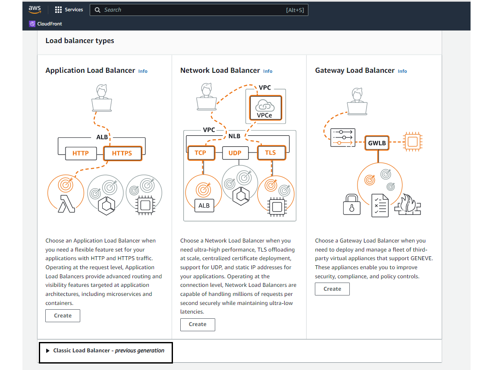
     &nbsp;<br>
   3. Give name to loadbalancer. Select VPC. Click on "Next".
      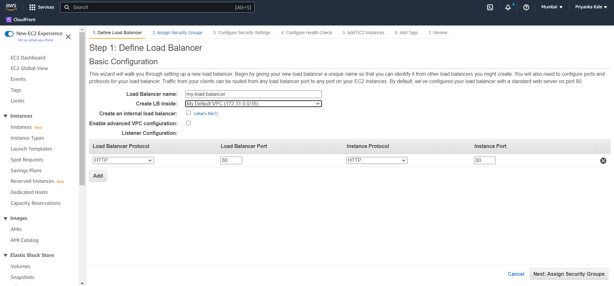
     &nbsp;<br>
   4. Click on "Create new security group". Add SSH & HTTP rules open for everyone. Click on "Next:Configure Health Check"
      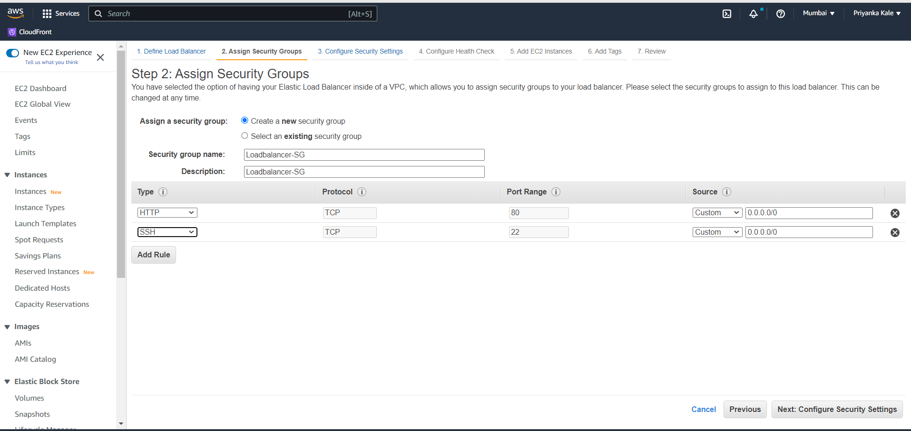
     &nbsp;<br>
   5. Add details to configure health check. Click on "Next:Add EC2 instances"
      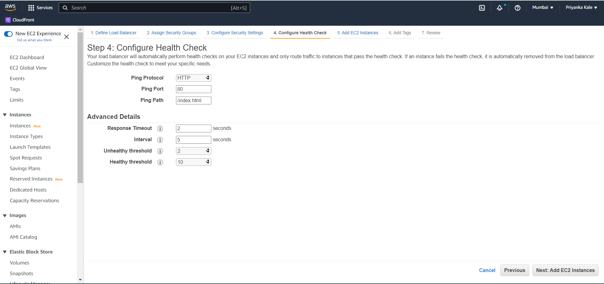
     &nbsp;<br>
   6. Select EC2 instances we want to configure. 
      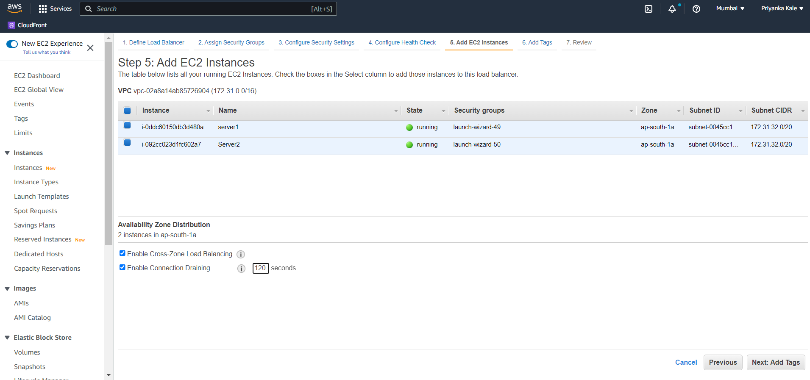
     &nbsp;<br>
   7. Add tag. Click on "Review & create". Then select loadbalancer. In description tab, copy DNS name.
      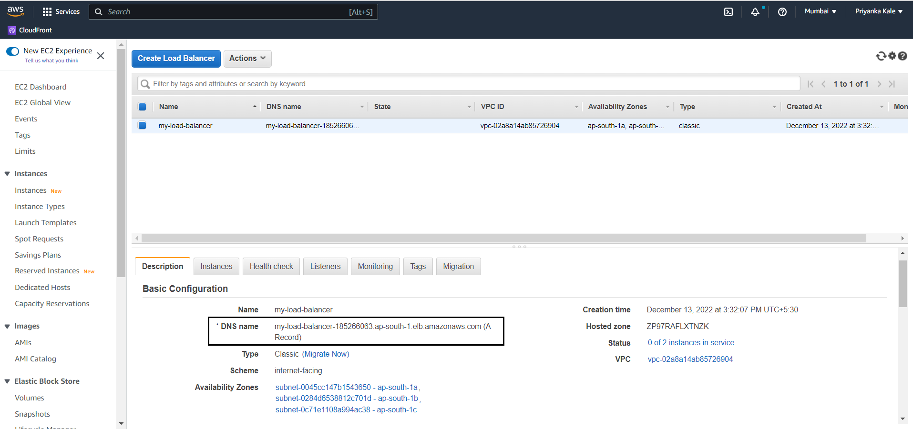
     &nbsp;<br>
   8. Paste DNS name into browser. You may see webpage of first webserver. Then reload the page, you may see webpage of second webserver.
      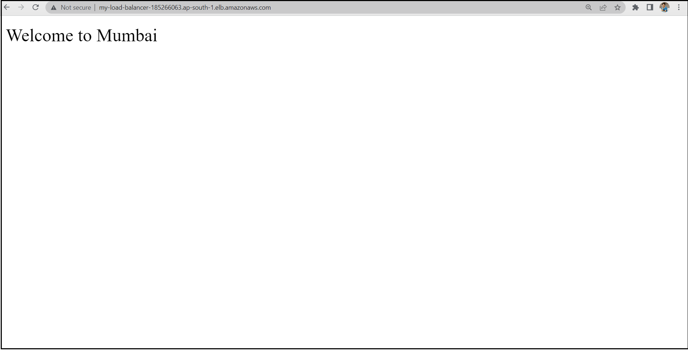
     &nbsp;<br>
     
     &nbsp;<br>