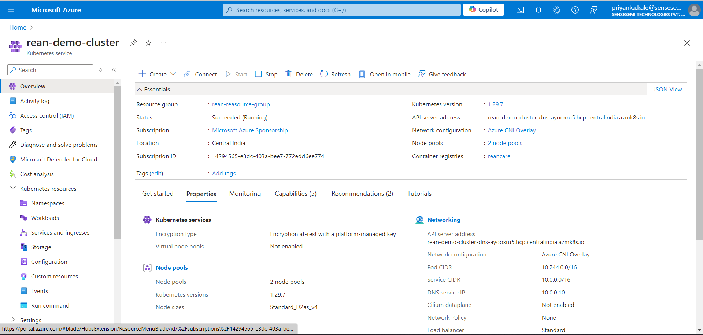

# Azure Kubernetes Service (AKS) Deployment Guide

This guide walks through the entire process of deploying services to Azure Kubernetes Service (AKS). We will cover the following steps:

1. [Prerequisites](#prerequisites)
2. [Create Docker Images](#create-docker-images)
3. [Push Images to Azure Container Registry (ACR)](#push-images-to-acr)
4. [Create an AKS Cluster](#create-an-aks-cluster)
5. [Kubernetes Manifests for Services](#kubernetes-manifests-for-services)
6. [Deploy Services to AKS](#deploy-services-to-aks)
7. [Monitoring](#monitoring)
8. [Cleanup Resources](#cleanup-resources)

---

## Prerequisites

Ensure the following tools are installed and configured before proceeding:

- **Azure CLI**: [Install Azure CLI](https://docs.microsoft.com/en-us/cli/azure/install-azure-cli)
- **Docker**: [Install Docker](https://docs.docker.com/get-docker/)
- **Kubectl**: [Install kubectl](https://kubernetes.io/docs/tasks/tools/install-kubectl/)
- **Azure Subscription**: You need an active Azure account. [Sign up](https://azure.microsoft.com/en-us/free/) if you don’t have one.
- **Visual Studio Code** (optional): For editing code and manifests. Install the Kubernetes and Docker extensions for easier management.

---

## Create Docker Images

We will create Docker images for our services. Suppose you have a service folder structure like this:

```bash
/services
  ├── service1
  ├── service2
```

### Dockerfile Example

Below is an example of a Dockerfile for a Node.js-based service:

```dockerfile

FROM node:18

WORKDIR /app

COPY package*.json ./
RUN npm install

COPY . .

EXPOSE 3000

CMD ["node", "src/index.js"]
```

### Build Docker Image

Build the Docker images for your services:

```bash
cd service1
docker build -t myregistry.azurecr.io/service1:latest .
cd ../service2
docker build -t myregistry.azurecr.io/service2:latest .
```

Replace `myregistry.azurecr.io` with your actual ACR name.

---

## Push Images to ACR

You need to push the Docker images to the Azure Container Registry (ACR).

1. **Create ACR**

First, create an ACR if you don’t already have one:

```bash
az acr create --resource-group <your-resource-group> --name <your-acr-name> --sku Basic
```

2. **Login to ACR**

Log in to your ACR using Azure CLI:

```bash
az acr login --name <your-acr-name>
```

3. **Push Docker Images**

Tag the images and push them to your ACR:

```bash
docker push myregistry.azurecr.io/service1:latest

docker push myregistry.azurecr.io/service2:latest
```


---

## Create an AKS Cluster

1. **Create Resource Group**

    1. Navigate to the [Azure Portal](https://portal.azure.com/).
    2. Search for **Resource Groups** in the search bar at the top.
    3. Click on **Create** to create a new resource group.
    4. Fill in the required details like **Subscription**, **Resource group name**, and **Region**, then click **Review + create** and finally **Create**.

2. **Create AKS Cluster**

    1. In the Azure Portal, search for **Kubernetes services** in the search bar at the top.
    2. Click **Create** to create a new Kubernetes cluster.
    3. Select your **Subscription** and the **Resource group** you just created.
    4. In the **Basics** tab, fill in:
    - **Kubernetes cluster name**: Choose a unique name for your cluster.
    - **Region**: Select the region where you want to deploy the AKS cluster.
    - **Kubernetes version**: You can select the default or choose a specific version.
    - **Node size**: Select the VM size for your nodes (e.g., Standard_DS2_v2).
    - **Node count**: Set the initial number of nodes (default is 3).

    5. Optionally, configure more options in the **Node pools**, **Authentication**, **Networking**, and **Monitoring** tabs, or just use the defaults.
    6. Review your settings and click **Create**.

3. **Configure Monitoring (Optional)**

While creating the AKS cluster, you can enable **Azure Monitor for containers** to monitor the performance and health of your cluster. In the **Monitoring** tab, simply turn on **Enable container insights**.

4. **Get AKS Credentials**

    Once the AKS cluster is created:
    1. Go back to **Kubernetes services**.
    2. Click on your newly created cluster.
    3. In the **Overview** section, click on **Connect**.
    4. Follow the instructions to download the **kubectl** configuration. Use Azure Cloud Shell (or a local terminal with Azure CLI installed) to connect to the cluster.



To connect to created AKS cluster from your local machine, you may refer connect instructions given on Azure Portal as shown in image below. Example command is as follows-

```bash
az aks get-credentials --resource-group <your-resource-group> --name <your-cluster-name>
```


---

## Kubernetes Manifests for Services

Create Kubernetes manifest files for your services. The basic components you need are Deployments and Services.

1. **Deployment Manifest (service1-deployment.yaml)**

```yaml
apiVersion: apps/v1
kind: Deployment
metadata:
  name: service1-deployment
spec:
  replicas: 3
  selector:
    matchLabels:
      app: service1
  template:
    metadata:
      labels:
        app: service1
    spec:
      containers:
      - name: service1
        image: myregistry.azurecr.io/service1:latest
        ports:
        - containerPort: 3000
```

2. **Service Manifest (service1-service.yaml)**

```yaml
apiVersion: v1
kind: Service
metadata:
  name: service1-service
spec:
  selector:
    app: service1
  ports:
    - protocol: TCP
      port: 80
      targetPort: 3000
  type: LoadBalancer
```

---

## Deploy Services to AKS

Once your manifests are ready, deploy the services using `kubectl`.

1. **Apply Manifests**

Deploy the service and its resources to AKS:

```bash
kubectl apply -f service1-deployment.yaml
kubectl apply -f service1-service.yaml

kubectl apply -f service2-deployment.yaml
kubectl apply -f service2-service.yaml
```

2. **Verify Deployment**

Check the status of your deployment:

```bash
kubectl get pods
kubectl get services
```

You should see the pods for your services running and an external IP for the services.

---

## Monitoring

1. **Monitor using Lens IDE**

- You can use Lens IDE to view the deployments of your AKS cluster. You may refer this [documentation](https://docs.k8slens.dev/) for more information of Lens IDE.

- Open Lens. Select AKS cluster from list of clusters there.


- You may see the overview of the cluster as shown in the image below:


- You may also check workloads, services, networks and other created artifacts there. You may also watch the logs for specific pods in this IDE.

- You may also check your deployments on Azure Portal which can look similar to the given image.


- To test deployments, you need to go `Services and Ingresses` option and select the service to test. You may see there the `External IP`. Using that IP and published port, you may test your deployed services. Some examples are given below:


---

## Cleanup Resources

To clean up resources after you're done, delete the resource group, which will remove all associated resources, including the AKS cluster and ACR.

```bash
az group delete --name <resource-group-name> --yes --no-wait
```

---

## Conclusion

Using these steps you can deploy your services on AKS cluster and easily monitor and test them.

