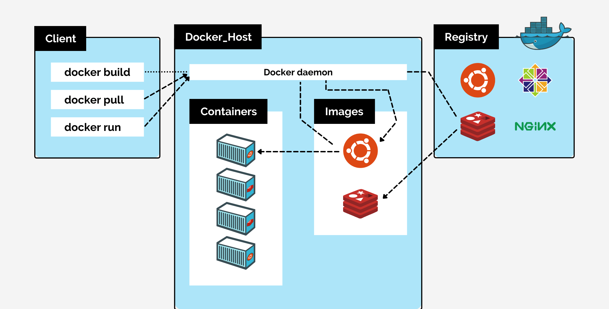
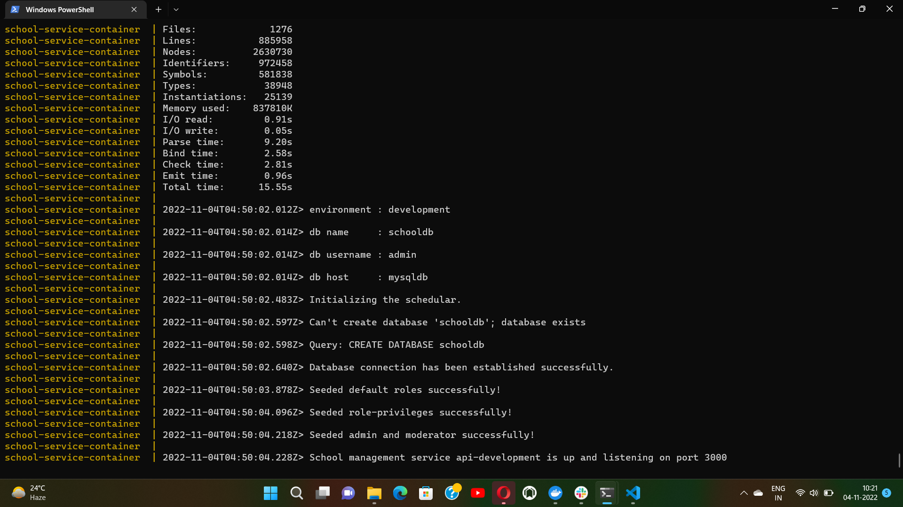
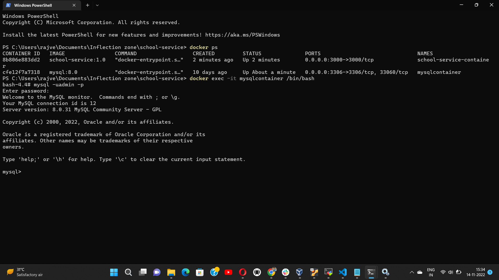
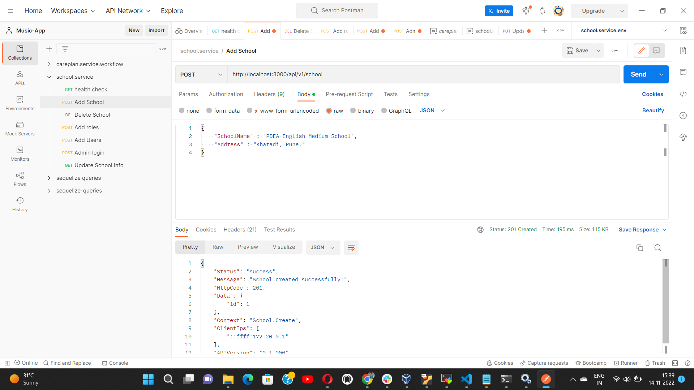
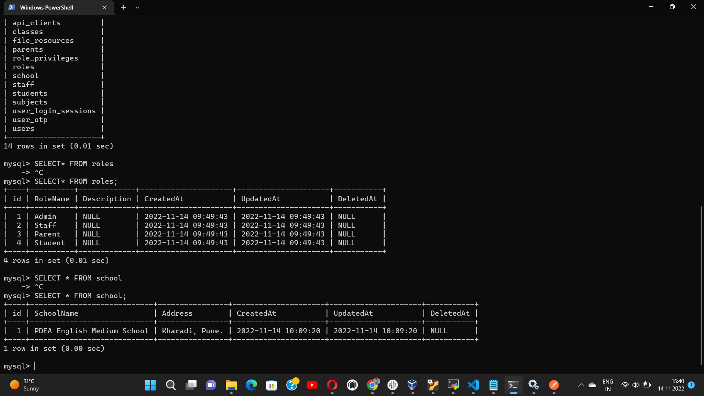

# Docker Overview

- Docker is an open platform for developing, shipping, and running applications. Docker enables you to separate your applications from your infrastructure so you can deliver software quickly. Using Docker’s methodologies for shipping, testing, and deploying code quickly, you can significantly reduce the delay between writing code and running it in production.
- Docker provides tooling and a platform to manage the lifecycle of your containers:

  - Develop your application and its supporting components using containers.
  - The container becomes the unit for distributing and testing your application.
  - When you’re ready, deploy your application into your production environment, as a container. This works the same whether your production environment is a local data center or a cloud provider.

# Docker is used for:

- **Fast, consistent delivery of your applications**
  - Consider developing an application having various technologies like node.js based webserver, database like mysql or mongodb, communication systems like messaging and many more. We need to face different issues while developing such an application stack with these different components.
  - First, their compatibilty with the undelying OS is the issue. We need to ensure that all these components are compatible with the version of OS we are planning to use. Many times this compatibility issue occurs & we need to go back and look for different OS version which will be compatible with the services we are using.
  - Second, we need to check compatibility between the services and libraries & dependancies on the OS. The architecture of our application will change over the time & we have to update to newer versions of these services or change the databases. And every time something changed we have to go through same process to check compatibility of these components with undelying infrastructure.
  - Third, every time if we have a new developer in the team, it will be very difficult & time consuming to set up new environment. The developer will have to follow large set of instructions & hundreds of commands to finally set up the environment. Also we need to make sure he is using right OS & right versions of all the components. We would not guarantee that the application we are building will run the same way in different environments.
  - All these issues will make developing, building & shipping an application very difficult. So here comes Docker to the rescue.
  - Docker streamlines the development lifecycle by allowing developers to work in standardized environments using local containers which provide your applications and services. Containers are great for continuous integration and continuous delivery (CI/CD) workflows.
- **Responsive deployment and scaling**
  - Docker’s container-based platform allows for highly portable workloads. Docker containers can run on a developer’s local laptop, on physical or virtual machines in a data center or on cloud providers.
  - Docker’s portability and lightweight nature also make it easy to dynamically manage workloads, scaling up or tearing down applications and services as business needs dictate.
- **Running more workloads on the same hardware**

# Docker Architecture

The Docker architecture uses a client-server model and comprises of the Docker Client, Docker Host, Network and Storage components, and the Docker Registry / Hub.



**Docker Client**

- The Docker client enables users to interact with Docker.
- The Docker client can reside on the same host as the daemon or connect to a daemon on a remote host.
- The Docker client provides a command line interface (CLI) that allows you to issue build, run, and stop application commands to a Docker daemon.

**DockerHost**

- The Docker host provides a complete environment to execute and run applications. It comprises of the Docker daemon, Images, Containers, Networks, and Storage.
- The daemon is responsible for all container-related actions and receives commands via the CLI or the REST API. It can also communicate with other daemons to manage its services.
- The Docker daemon pulls and builds container images as requested by the client.

**Docker Objects**

- **Images**

  - Images are a read-only binary template used to build containers. Images also contain metadata that describe the container’s capabilities and needs.
  - Images are used to store and ship applications. An image can be used on its own to build a container or customized to add additional elements to extend the current configuration.

- **Containers**

  - Containers are encapsulated environments in which you run applications.
  - The container is defined by the image.
  - Containers only have access to resources that are defined in the image, unless additional access is defined when building the image into a container.
  - Since containers are much smaller than VMs, they can be spun up in a matter of seconds, and result in much better server density.

- **Networks**

  - Docker implements networking in an application-driven manner and provides various options while maintaining enough abstraction for application developers.
  - There are basically two types of networks available – the default Docker network and user-defined networks.

- **Storage**
  - You can store data within the writable layer of a container but it requires a storage driver. Being non-persistent, it perishes whenever the container is not running.
  - In terms of persistent storage, Docker offers four options: Data Volumes, Data Volume Container, Directory Mounts, Storage Plugins.

**Docker Registries**

- Docker registries are services that provide locations from where you can store and download images. In other words, a Docker registry contains Docker repositories that host one or more Docker Images.

# Deploy service to Docker using docker-compose

Following are the steps to deploy a node.js application with mysql database to docker:

1.  Create a node.js based application having mysql database with APIs.

2.  Make sure your service is running successfully on local system.

3.  Download & install docker on your system.

4.  Create a Dockerfile inside your service folder with name "Dockerfile":
    (https://docs.docker.com/develop/develop-images/dockerfile_best-practices/)

- Click on create new file.
- Name it as "Dockerfile".
- Add VS Code suggested extension for Docker.

An example of a Dockerfile is given below:

```
FROM node:19-alpine3.16 AS builder
ADD . /app
RUN apk add bash
RUN apk add --update alpine-sdk
WORKDIR /app
COPY package*.json /app/
RUN npm install -g typescript
COPY src ./src
COPY tsconfig.json ./
RUN npm install
RUN npm run build

# RUN npm run build

FROM node:19-alpine3.16
RUN apk add bash
RUN apk add --update alpine-sdk
RUN apk update
RUN apk upgrade
ADD . /app
WORKDIR /app
COPY package*.json /app/
# RUN npm install pm2 -g
# RUN npm install sharp
COPY --from=builder ./app/dist/ .
EXPOSE 3000
CMD ["npm","run","start"]
```

5. Create a docker-compose file with yaml OR yml extension.(eg. docker-compose.yaml OR docker-compose.yml)
   (https://www.youtube.com/watch?v=_JNTTgRDyBQ One can refer this video tutorial for creating & running docker compose file for node.js app using mysql database.)
   Example of a docker-compose file:

```
services:
  mysqldb:
    image: mysql:8.0
    container_name: mysqlcontainer
    command: --default-authentication-plugin=mysql_native_password
    restart: unless-stopped
    volumes:
      - ./dbinit/init.sql:/docker-entrypoint-initdb.d/0_init.sql
      - $HOME/database:/var/lib/mysql
    ports:
      - 3306:3306
    expose:
      - 3306
    environment:
      MYSQL_DATABASE: schooldb
      MYSQL_USER: admin
      MYSQL_PASSWORD: letmein
      MYSQL_ROOT_PASSWORD: letmein
      SERVICE_TAGS: prod
      SERVICE_NAME: mysqldb
    networks:
      - internalnet

  nodeapp:
    container_name: school-service-container
    build: .
    image: school-service:1.0
    volumes:
      - $HOME/nodeapp:/code
    ports:
      - 3000:3000
    expose:
      - 3000
    environment:
      DB_HOST: mysqldb
      DB_PORT: 3306
      DB_USER: admin
      DB_PASSWORD: letmein
      DB_NAME: schooldb
      DB_CONNECTION_LIMIT: 20
      SERVICE_TAGS: prod
      SERVICE_NAME: school-service
      SERVER_PORT: 3000
    depends_on:
      - mysqldb
    networks:
      - internalnet
networks:
  internalnet:
    driver: bridge
```

6. Go to .env file and change database configuration variable values according to your docker-compose file.

**Note** : If you have mysql service running on your PC/host, you need to stop it first. If you don't stop it, it will throw error that port 3306 is already in use as by default mysql uses port 3306 on host & our container also try to access it.

7. Open terminal inside your service folder. Write command `docker-compose up --build`.
   ("docker-compose up" command starts the containers. "--build" option build images before starting containers.)

  

8. You may see your built image & list of all other images using `docker images` or `docker image ls` command.


9. To see list of running containers, use "docker ps" command. To see list of all running and exited containers, use "docker ps -a" command.


10. You may access your containers using `docker exec -it <container name> /bin/bash` command.
    (If bash is not installed you may use `docker exec -it <container name> /bin/sh`)

11. Inside database container, login to mysql using `mysql -u<username> -p` command. It will prompt you to enter password. \* After login you may see databases, tables, use other mysql commands.



12. Send API requests from postman and you can see changes in database in container as well.




