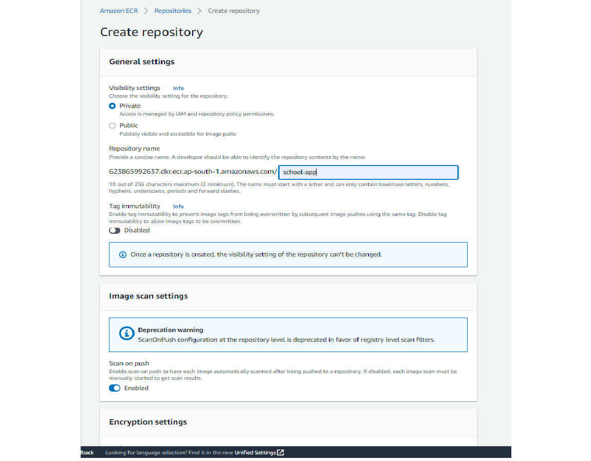
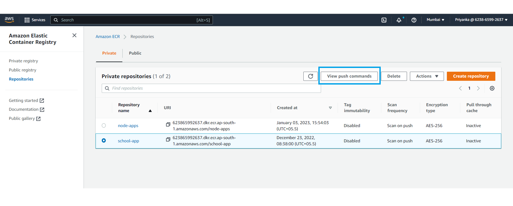
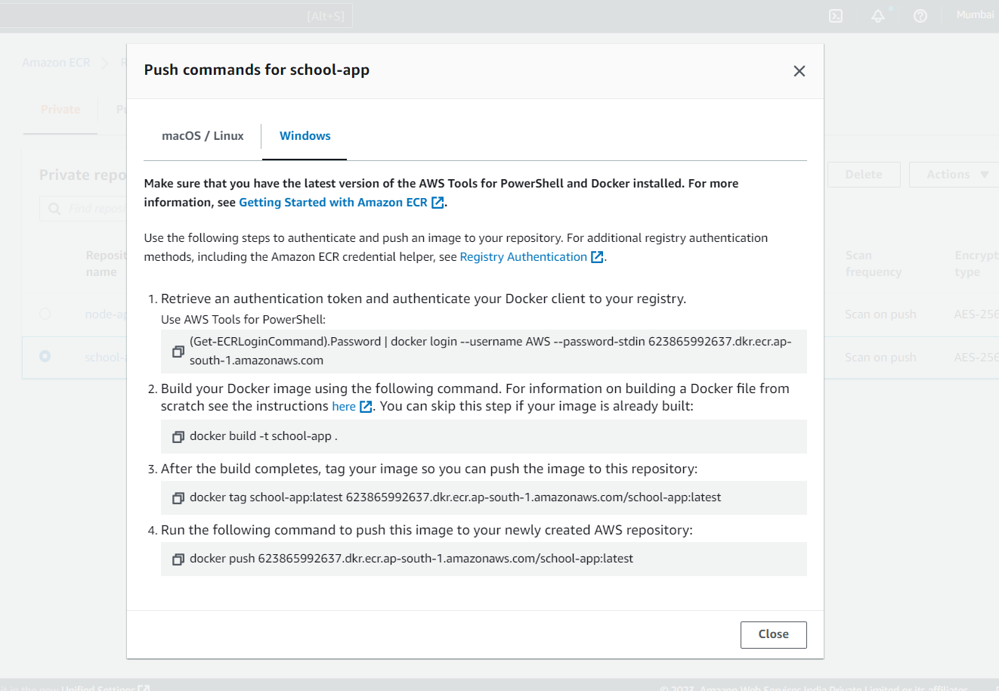

# Store Docker Images on AWS Elastic Container Registry

## Prerequisites
1. Docker Desktop should have installed on your system.
2. You should have an AWS account.
3. You should have AWS CLI installed and configured with IAM user credentials.

## Create Docker Image of Node.js Application

1. Open your application directory in code editor like VS Code.
2. In root directory, create a new file and name it as `Dockerfile` without any extensions.
3. Add configurations in this dockerfile according to your application. Sample dockerfile is given below:
    ```
    FROM node:8

    # Create app directory
    WORKDIR /app

    # Install app dependencies
    COPY package*.json ./

    RUN npm install

    COPY . .

    EXPOSE 3000

    CMD [ "npm", "start" ]

    ```
    For more information about how to write a dockerfile, please refer [Docker's documentation](https://docs.docker.com/develop/develop-images/dockerfile_best-practices/)

4. Save the file and open terminal. Build a docker image using this dockerfile. To do so, run following command:
    ```
    docker build -t my-app .
    ```
5. This will take few minutes to build an image. Once completed, run following command to see whether our application docker image is built successfully:
    ```
    docker image ls
    ```
    You may see the list of docker images you have built so far. Your current image is `my-app:latest`.
6. Now you need to test your application image by running a docker container. To do so, run following coomand:
    ```
    docker run -d -p <Your_LOCAL_PORT>:<APP_EXPOSED_PORT> -e <ENV_VARIABLE_IF_ANY> my-app:latest
    ```
7. Once the container is in running state, test your application at local port you gave in the command. If it is running exactly as on your local system, our application docker image is built fine.

## Push Image to AWS ECR
1. Login to your AWS console. Search for `ECR` in searchbox next to services tab. Select ECR. You may see ECR console page.
2. Select `Create Repository`. Fill the details as shown in following image:
&nbsp;<br>
   

    Here, give your own repository name instead of "school-app". Enable `Scan on push` and keep othe fields as they are.
&nbsp;<br>
3. Once repository is created, select it & click on "View push commands"

    
&nbsp;<br>

4. It will then show all the steps and commands you need to use to push your apllication image to this repository. Follow the steps according to your OS.
&nbsp;<br>
   
&nbsp;<br>

5. Out of given commands, we have already done building of docker image i.e. step no.2. So you can skip it. Follow all other steps to push your dockerfile on ECR.