# Overview
* Kubernetes is an open source container orchestration platform that automates deployment, management and scaling of applications. 
* It is also known as “k8s”. K8s as an abbreviation results from counting the eight letters between the "K" and the "s"
* Kubernetes was first developed by engineers at Google before being open sourced in 2014. Later it is donated to CNCF(Cloud Native Computing Foundation)
* It is a descendant of Borg, a container orchestration platform used internally at Google.
* Kubernetes originates from Greek, meaning helmsman or pilot, hence the helm in the Kubernetes logo
* It is written in "Go Language" developed by Google.

# Container management tool:
* A tool that automates deploying, scaling & managing "containerized apllications" on a group of servers.
* Container management tools:
    - Kubernetes
    - Docker Swarm
    - Apache Mesos Marathon
    - Openshift
    - Hasicorp Nomad
* There are many cloud-based managed container orchestration tools: 
  - Google Kubernetes Engine (GKE)
  - AWS Elastic Kubernetes Service (EKS) 
  - Azure Kubernetes Service (AKS)

# Containerized Appliication:
* In containerization, a developer packages application along with all its dependencies, libraries and entire environment in a box called as container. 
* This then can be shipped using platform like docker & then it can be deployed on different systems.
* Advantage of this kind of deployment is because we know that application is available with all its environments & dependencies, so it will work fine on every system. So the issue that application running on one system & not on another is taken care by containerization. 
* So "Docker" is a tool designed to make it easier to deploy & run application by using containers & container allow developers to package their application along with all the libraries & dependencies & ship it as a single package.

# Why Kubernetes:
* We know the advantages of containerization, however in real time, large organizations use many containers for single application. There are hundreds & thousands of containers to ensure availibilty.
* We have to take care of- 
  - deploying application on multiple containers on multiple servers.
  - scheduling these deployments
  - Autoscaling
  - load-balancing
  - batch execution
  - rollbacks & 
  - monitoring
* All these process are very difficult to do manually. So to automate these processes, we have "container management tools".
* Among them "Kubernetes" is the most popular & widely used tool.

# Features of Kubernetes:
1. Automatic bin packing:
   - Let's take an example that we have five servers, each having 10 GB RAM & we have list of jobsto run on these servers. Every job is having different memory requirement.
   - Kubernetes helps us doing this. It will pack these jobs(containers) in bins(servers) in the most efficient way.
   - Kubernetes automatically places containers based on their resource requirements like CPU & memory while not sacrificing availibility of applications & it will also save the resources.
2. Service discovery & load-balancing: 
   - Kubernetes does not interact with containers directly. Instead it wraps one or more containers into a higher level structure called "Pod".
   - A Pod is having application container, storage & unique IP.
   - We can have multiple pods having same set of functions are abstracted into sets called "Services".
   - So single service can be run using multiple pods & therefore we have a service containing multiple pods & this service is given a DNS name by Kubernetes.
   - With this setup, K8s has complete control over networking and communication between pods and can also do teh load-balancing across them.
3. Storage orchestration: 
   - Single volume is shared among the containers running in a pod.
   - Kubernetes allow us to choose this volume. It can be from local storage or cloud storage like EBS or a network storage like NFS.

4. Self healing:
   - In k8s, if the container fails, it will try to restart the container.
   - If a node fails, it replaces the node & reschedule the containers on new node. 
   - If container does not respond to teh user-defined health-check, it kills the container.

5. Automated rollouts & rollbacks: 
   - Rollout: deploying new changes to apllication or its configuration  
   - Rollback: just in case we have to revert those changes and restore the application to its previous state, it is calles as rollback
   - Kubernetes progressively rolls out changes to application or its configuration while monitoring health of application to ensure it  doesn't kill all your instances at the same time.
   - If something goes wrong, it will rollback. All this time of rollout or rollback, our apllication will be up. There will be no downtime. 
6. Secret & configuration management: 
   - Secret: It is an object that handles sensitive data like passwords, keys, tokens. 
   - Configmap: This object handles configurations 
   - Secret & configmap are created outside the pod.
   - As they are located outside & not coupled with pod or container, it makes them portable and easy to manage.
   - So with this feature, we can manage secrets& configurations separately from the image & it also helps to deploy & update secrets & configurations without rebuilding the image. 
7. Batch Execution: 
   - Batch job require an executable or process to be run to completion. 
   - In Kubernetes, run to completion jobs are primarily used for batch execution.
   - Each job creates one or more pods.
   - During job execution, if any pod or container fails, job controller will reschedule the container/pods to another node.
   - Once the job is completed, the pods will move from running to shut down state.

8. Horizontal scaling: 
   - In kubernetes, we can scale up & down the containers.
   - Scale up means to create more replicas of container if required & scale down means kill the container if these are not required.
   - There are 3 tools in k8s for horizontal scaling: Replication Controller, manifest file, horizontal pod autoscaler.
   - Replication controller is a structure that enables to create multiple pods, then makes sure that number of pods always exist.
   - In case, if any pod crashes, the replication controller replaces it.
   - Replication controller gets the no. of pods to create & make available always from a file called as manifest.
   - In manifest file, there is a property called "replicas" & there is a count there. So if we configure as "replicas:3", the replication controller create 3 replicas of the pod & will ensure that the desired no. of pods are always maintained.
   - We have another structure called horizontal pod autoscaler. It will monitor the CPU utilization & based on this matrix it sets the no. of pods required & based on that, replication controller will maintain that no. of pods. 

# Architecture of Kubernetes: 
* In Kubernetes, we have a master & worker nodes. Together they form a team called "Cluster".
* When we deploy kubernetes we actuallyget a cluster & cluster is made of set of machines called nodes.
* A cluster has atleast one master & one worker node. There can be more than one master nodes in a cluster to provide features of failover & high availability.
* A node can be a physical machine or virtual machine or a VM on cloud. Nodes are having pods inside & pods having container.


* **Master** : 
  - It is responsible for managing the cluster. 
  - It monitors nodes & pods in cluster.
  - When a node fails, it moves workload of failed node to another worker node.
  - Components of Master:
    1. API Server: 
       - It is responsible of all communication. 
       - It is front end for the kubernetes control plane.
       - API server exposes some APIs so that the users can interact with server. 
       - To call the APIs we can use command line tool or User Interface.
       - "kubectl" is command line tool. Users interact with API using kubectl.
    2. Schedular: 
       - It schedules pods across worker nodes. 
       - As we know, nodes are physical or virtual machines with different configuration. Schedular knows this configuration & whenever it has to schedule a pod, it will check which node filts best for the configuration of pod & accordingly it will schedule the pod on the required node.
    3. Controller Manager:
       - It is responsible for health of the cluster. 
       - It monitors health of the nodes & ensures nodes are running all the time.
       - It also ensures that the correct no. of pods are running as per the specifications file.
       - There are four controllers: Node controller, Replication controller, Endpoints controller, Service account & token controller. 
       - Controller continuously compare cluster's desired state to its current state. In case any mismatch, corrective action is taken by the controller until current state matches the desired state.  
    4. ETCD: 
       - It is an open-source, distributed key-value data store.
       - Only API server can interact with ETCD directly. 
       - It is highly available, key-value store and used as kubernetes backing store for all cluster data. 

* **Worker Node**: 
  - It is a physical or virtual machine where containers are deployed. 
  - Every node should run a container runtime like Docker.
  - Components of worker-node:  
    1. Kubelet: 
       - Each worker node includes a kubelet, an agent that communicates with the master to ensure the containers in a pod are running. 
       - When the master requires a specific action happen in a node, the kubelet receives the pod specifications through the API server and executes the action. It then ensures the associated containers are healthy and running.
    2. kube-proxy: 
       - It is a core networking component of worker node. 
       - It can interact with the external world as well.
       - It is reponsible for maintaining network configuration and rules on node.
    3. Container runtime: 
       - The container runtime is the software that is responsible for running containers. 
       - Kubernetes supports container runtimes such as Docker, containerd, CRI-O, Rocketlet etc.
       - The most commonly used platform is Docker. 

# Kubernetes Objects:
* Kubernetes objects are persistent entities in the Kubernetes system. 
* Kubernetes uses these entities to represent the state of your cluster. 
* By creating an object, we are telling kubernetes system what we want our cluster's workload to look like. 
* Specifically, they can describe: 
  - What containerized applications are running (and on which nodes)
  - The resources available to those applications
  - The policies around how those applications behave, such as restart policies, upgrades, and fault-tolerance
* These objects are distinguish between "workload-oriented" objects that are used for handling container workloads and "infrastructure oriented" objects that handle configuration, networking and security.
* We can describe these objects in .yaml file called "manifest".
* Following is the list of objects in k8s: 
  - Pod 
  - Service 
  - Volume 
  - Namespace 
  - Replicasets 
  - Secrets 
  - Configmaps 
  - Deployments 
  - Jobs 
  - Daemonsets etc. 

  1. Pods: 
     - Pods are the smallest unit of deployment in Kubernetes. 
     - They reside on cluster nodes and have their IP addresses, enabling them to communicate with the rest of the cluster. 
     - A single pod can host one or more containers, providing storage and networking resources.
     - A pod can fail without impacting the system's functioning. 
     - Kubernetes automatically replaces each failed pod with a new pod replica and keeps the cluster running. 
     - Pods also store configuration information that instructs Kubernetes on how to run the containers.
  2. Services: 
     - Services provide a way to expose applications running in pods. 
     - Their purpose is to represent a set of pods that perform the same function and set the policy for accessing those pods. 
     - Although pod failure is an expected event in a cluster, Kubernetes replaces the failed pod with a replica with a different IP address. This creates problems in communication between pods that depend on each other. 
     - Using the kube-proxy process that runs on each cluster node, Kubernetes maps the service's virtual IP address to pod IP addresses. 
     - This process allows for easier internal networking but also enables exposing of the deployment to external networks via techniques such as load balancing. 

   3. Volumes: 
      - Volumes are objects whose purpose is to provide storage to pods. 
      - There are two basic types of volumes in Kubernetes: 
        - Ephemeral volumes persist only during the lifetime of the pod they are tied to.
        - Persistent volumes, which are not destroyed when the pod crashes. Persistent volumes are created by issuing a request called PersistentVolumeClaim (PVC). Kubernetes uses PVCs to provision volumes, which then act as links between pods and physical storage.

   4. Namespaces: 
      - The purpose of the Namespace object is to act as a separator of resources in the cluster. 
      - A single cluster can contain multiple namespaces, allowing administrators to organize the cluster better and simplify resource allocation.
      - A new cluster comes with multiple namespaces created for system purposes and the default namespace for users. 
      - Administrators can create any number of additional namespaces. For example, one for development and one for testing.
      
   5. ReplicaSets: 
      - ReplicaSets serve the same purpose as ReplicationControllers, i.e. maintaining the same number of pod replicas on the cluster. 
      - However, the difference between these two objects is the type of selectors they support. While ReplicationControllers accept only equality-based selectors, ReplicaSets additionally support set-based selectors.
      - Set-based selectors allow using a set of values to filter keys. The statements accept three operators: in, notin, and exists.

   6. Deployments: 
      - Deployments are controller objects that provide instructions on how Kubernetes should manage the pods hosting a containerized application. Using deployments, administrators can: 
        - Scale the number of pod replicas.
        - Rollout updated code.
        - Perform rollbacks to older code versions.
      - Once created, the deployment controller monitors the health of the pods and nodes. 
      - In case of a failure, it destroys the failed pods and creates new ones. 
      - It can also bypass the malfunctioning nodes, enabling the application to remain functional even when a hardware error occurs. 
   
   7. ConfigMaps: 
      - ConfigMaps are Kubernetes objects used to store container configuration data in key-value pairs. 
      - By separating configuration data from the rest of the container image, ConfigMaps enable the creation of lighter and more portable images. 
      - They also allow developers to use the same code with different configurations depending on whether the app is in the development, testing, or production phase.
   
   8. Jobs: 
      - Jobs are workload controller objects that execute finite tasks. 
      - While other controller objects have the task of permanently maintaining the desired state and number of pods, jobs are designed to finish a task and terminate the associated pods. 
      - This property makes them useful for maintenance, monitoring, batch tasks, and work queue management. 
      - Job instances run simultaneously or consecutively. 
      - Scheduled jobs are a separate controller object called CronJob. 

   9. DaemonSets: 
      - DaemonSets are controller objects whose purpose is to ensure that specific pods run on specific (or all) nodes in the cluster.
      -  Kubernetes scheduler ignores the pods created by a DaemonSet, so those pods last for as long as the node exists. 
      - This object is particularly useful for setting up daemons that need to run on each node, like those used for cluster storage, log collection, and node monitoring. 
      - By default, a DaemonSet creates a pod on every node in the cluster. If the object needs to target specific nodes, their selection is performed via the nodeSelector field in the configuration file. 

* Object **Spec** and **Status**: 
  - Object spec and object status are two nested fields in the object configuration that Kubernetes utilizes to control the object. 
    - The spec field is used to declare the desired state of the object, i.e., the characteristics of the resource. The user provides this field when creating the object.
    - The status field provides information about the current object state. This field is provided by Kubernetes during the lifetime of the object.
  - Kubernetes control plane monitors the status of every object in the cluster and attempts to match the current state to the desired state.
  - For example, consider the following deployment YAML: The spec field states that the desired number of replicas for the nginx deployment is five. After the deployment is successfully created, Kubernetes monitors its status and updates the status field accordingly. If one replica fails, the status field reports only four running replicas, which triggers Kubernetes to start another pod.


```
  apiVersion: apps/v1
  kind: Deployment
  metadata:
    name: nginx-test
    labels:
      app: nginx
  spec:
    replicas: 5
    selector:
      matchLabels:
        app: nginx
    template:
      metadata:
        labels:
          app: nginx
      spec:
        containers:
        - name: nginx
          image: nginx:1.23.1
          ports:
          - containerPort: 80
```
* Object Required Fields:
  - When the user wants to create a Kubernetes object, the following fields must be provided in the YAML file:
    - `apiVersion` - Specifies the version of Kubernetes API for creating the object.
    - `kind` - Provides the object type, for example, Deployment, ReplicaSet, or Service.
    - `metadata` - Lists object identifiers, such as its name, UID, labels, and namespace.
    - `spec` - States the desired state for the object, like the number of replicas and the container image.

* Kubernetes Object Management: Kubernetes objects are managed using various GUI dashboards or using the kubectl CLI tool. With kubectl, users can manage objects by employing three distinct management techniques:
   1. Imperative commands:  
      - When using imperative commands, a user operates directly on live objects in a cluster. The user provides operations to the kubectl command as arguments or flags. 
      - This is the recommended way to get started or to run a one-off task in a cluster. Because this technique operates directly on live objects, it provides no history of previous configurations
      - Example - Run an instance of the nginx container by creating a Deployment object: 
       ` kubectl create deployment nginx --image nginx ` 

   2. Imperative object configuration: 
      - In imperative object configuration, the kubectl command specifies the operation (create, replace, etc.), optional flags and at least one file name.
      - The file specified must contain a full definition of the object in YAML or JSON format. 
      - Example- Create the objects defined in a configuration file:
       ` kubectl create -f nginx.yaml `
         &nbsp;<br> 
      - Delete the objects defined in two configuration files: 
       ` kubectl delete -f nginx.yaml -f redis.yaml` 
          &nbsp;<br>  
      - Update the objects defined in a configuration file by overwriting the live configuration:
       `kubectl replace -f nginx.yaml` 

   3. Declarative object configuration:
      - When using declarative object configuration, a user operates on object configuration files stored locally, however the user does not define the operations to be taken on the files. 
      - Create, update, and delete operations are automatically detected per-object by kubectl.
      - This enables working on directories, where different operations might be needed for different objects.
      - Example - Process all object configuration files in the configs directory, and create or patch the live objects. You can first `diff` to see what changes are going to be made, and then `apply`:
      `kubectl diff -f configs/`
      `kubectl apply -f configs/`
      
* Management of Kuberenetes objects using configuration files:
  Step 1 - Install `kubectl`: 
     - Download the latest release of "kubectl" from following url: https://dl.k8s.io/release/v1.26.0/bin/windows/amd64/kubectl.exe 
     - Create new folder & move the downloaded .exe file to that folder. Copy that folder's path.
     
     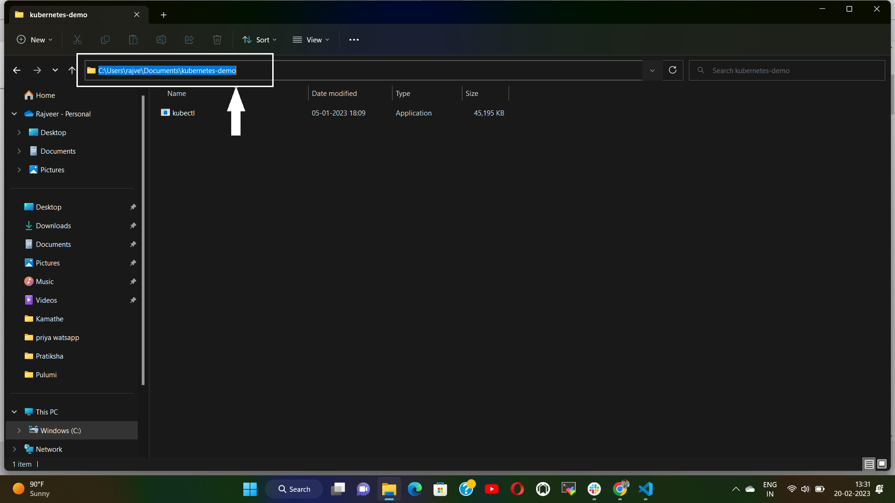

     - Open advanced system settings. Inside which go to "Environment variables". Then select "path" under "user variables". Click on "Edit".

     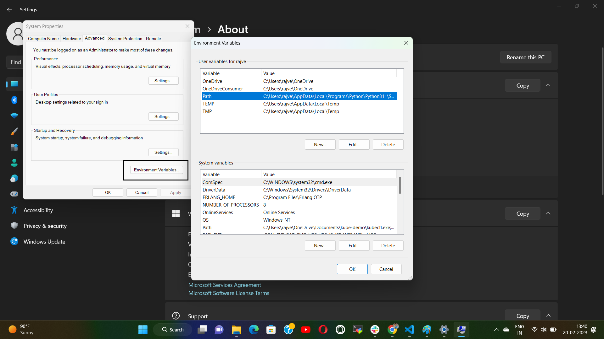 

     - Then click on "New". Paste copied folder path here. And click "Ok" 

     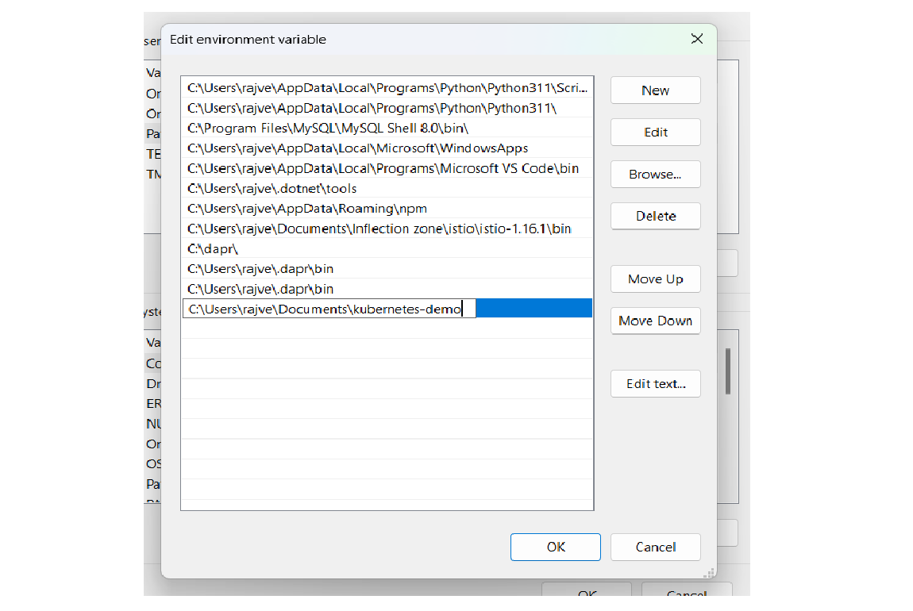 

    - You may now open command prompt & check this installation using command `kubectl version`. This will prompt you the kubectl client & server versions as shown: 
     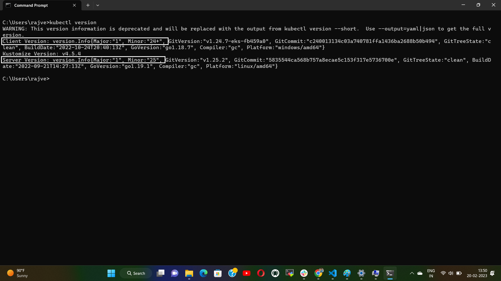 

  Step 2 - You need to have a Kubernetes cluster, and the kubectl command-line tool must be configured to communicate with your cluster. If you do not already have a cluster, you can create one by using "minikube". To install minikube: 
  - Download the latest release using following url: https://storage.googleapis.com/minikube/releases/latest/minikube-installer.exe 
  - Move this downloaded binary to the folder containing "kubectl.exe" as we have already added that folder to path of "Environment variables". 
  - You may verify that minikube is installed correctly by using `minikube version` command in command prompt. 

    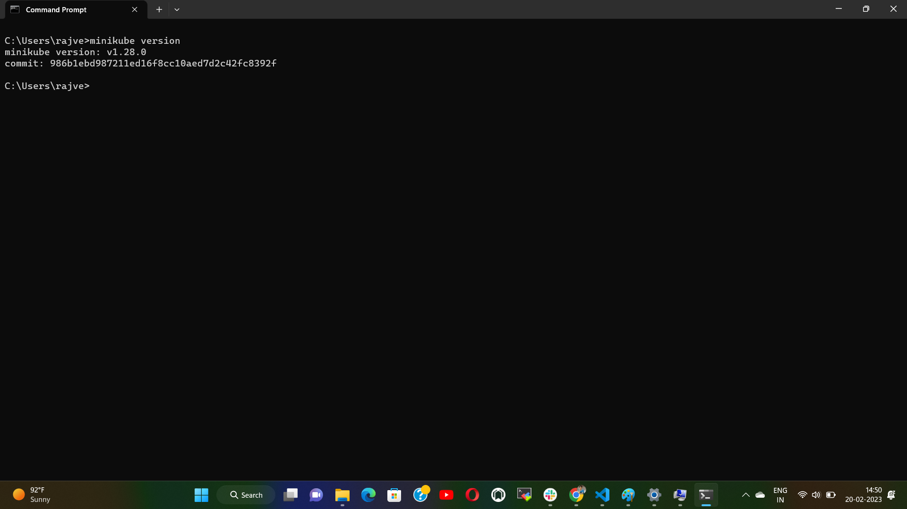 

  Step 3 - Start your cluster: From a terminal with administrator access, run:
   
    `minikube start` 

   - If you have docker installed, it will take docker as vm driver by default or you can select virtualbox or ssh as vrtual machine manager. 

     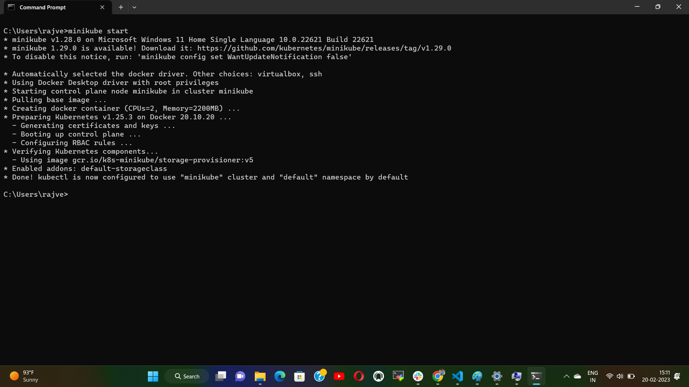 

  Step 4 - Create new folder. In which create new file name it as "pod2.yml". Write a manifest file to deploy a pod as follows: 
   ```
     kind: Pod
     apiVersion: v1
     metadata:
       name: testpod1
     spec:
       containers:
         - name: c01
           image: nginx
           command:
             [
               "/bin/bash",
               "-c",
               "while true; do echo Hello-Priyanka; sleep 5 ; done",
             ]
           ports:
             - containerPort: 80

   ``` 

  Step 5 - Open terminal and run command: `kubectl apply -f pod2.yml`. You will get output as: 
      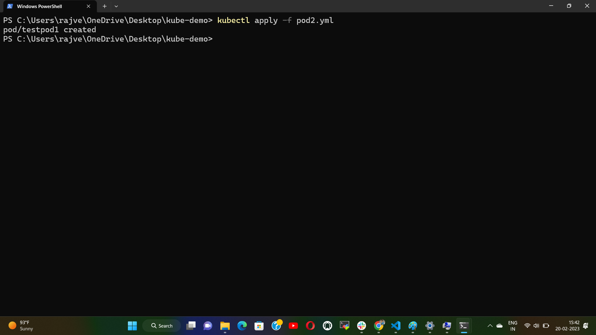 

  Step 6 - To see the deployment run command : `kubectl get pods` 
      
   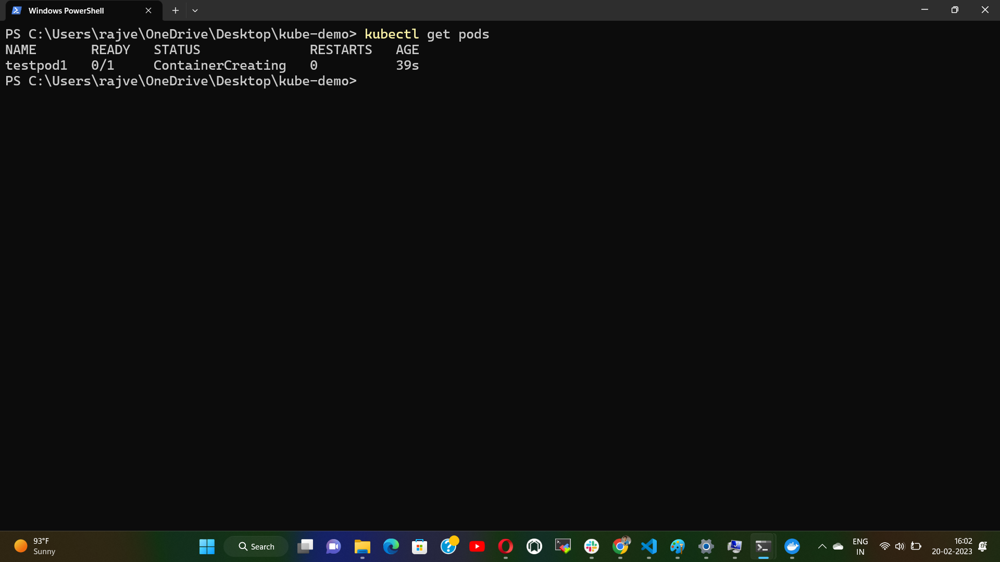 

  
  Step 7 - Details of pod can be seen using command : `kubectl describe pod/testpod1`  
    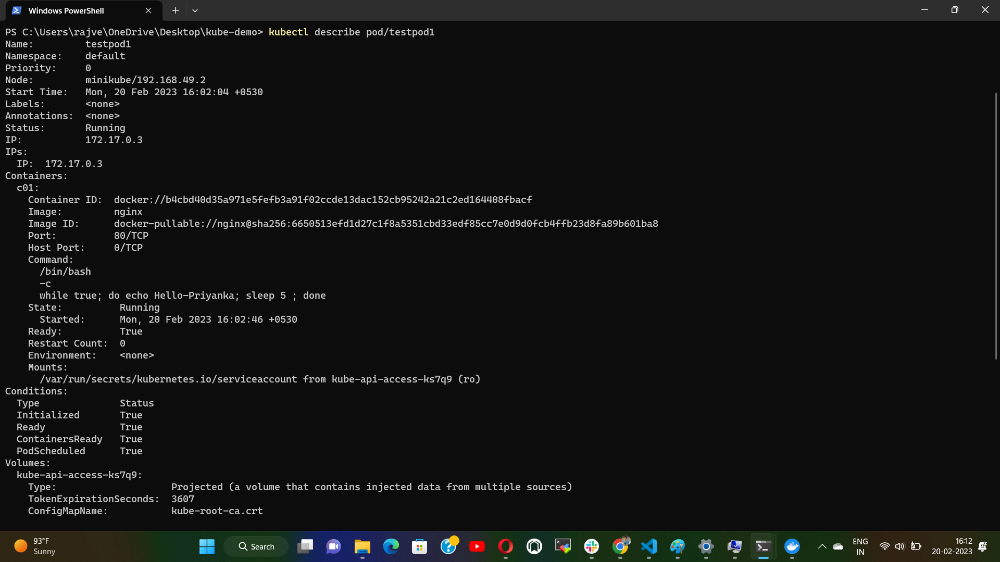

  Step 8 - Create a manifest file called "deploy.yml" for deployment object as follows: 
   ``` 
   kind: Deployment
   apiVersion: apps/v1
   metadata:
     name: mydeployments
   spec:
     replicas: 2
     selector:
       matchLabels:
         name: deployment
     template:
       metadata:
         name: testpod
         labels:
           name: deployment
       spec:
         containers:
           - name: c00
             image: centos
             command:
               [
                 "/bin/bash",
                 "-c",
                 "while true; do echo Hello-Minikube; sleep 5; done",
               ]

   ```
  Step 9 - Apply this deployment using `kubectl apply -f deploy.yml` 
     
    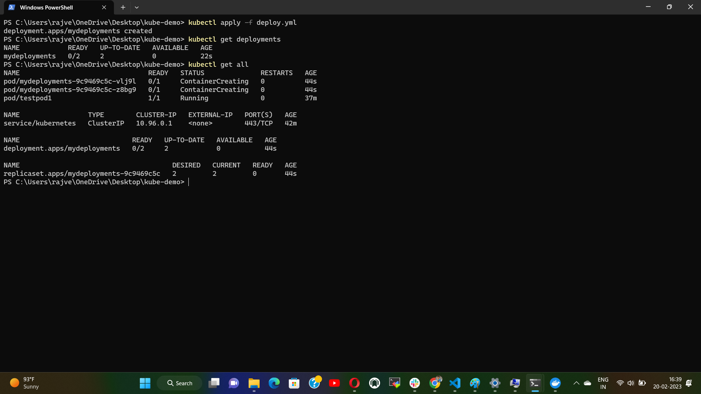 

  Step 10 - Write a manifest file for service and name it as "service.yml" 
   ```
   kind: Service
   apiVersion: v1
   metadata:
     name: demoservice
   spec:
     ports:
       - port: 80
         targetPort: 80
     selector:
       name: deployment 
     type: ClusterIP

   ```

  Step 11 - Apply this manifest using `kubectl apply -f service.yml` 
     
     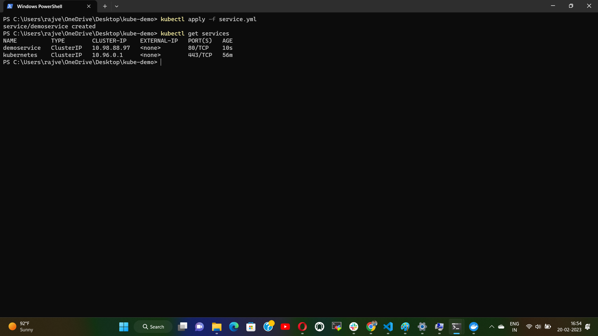 

# Service Discovery in K8s
* Kubernetes service discovery for API-aware clients: 
  - In Kubernetes, an application deployment consists of a pod or set of pods. Those pods are ephemeral, means the IP addresses and ports change constantly. This constant change makes service discovery a significant challenge in the Kubernetes world. 
  - One way Kubernetes provides service discovery is through its endpoints API. With the endpoints API, client software can discover the IP and ports of pods in an application. 
  - In the example below, the Kubernetes control plane ETCD acts as a service registry where all the endpoints are registered and kept up to date by Kubernetes itself. For example, a service mesh can implement logic to use an API for service discovery. That process is the native service discovery provided by Kubernetes. 
   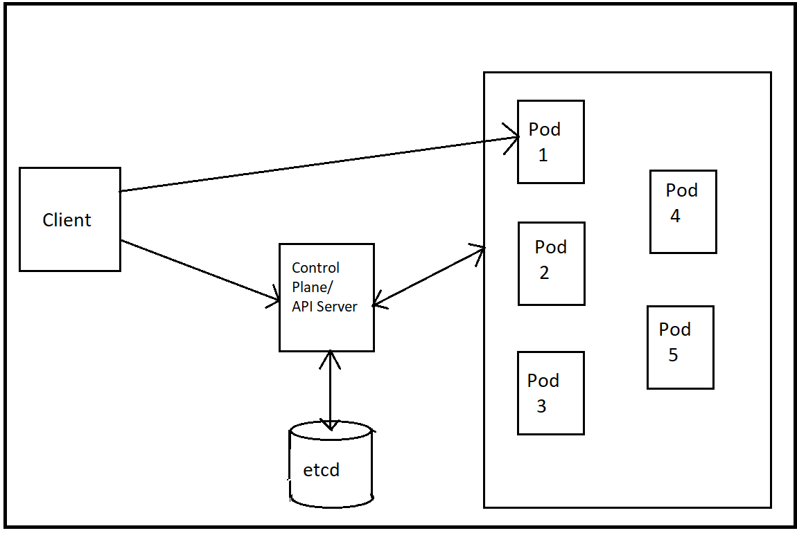 
   &nbsp;<br> 

* Kubernetes service discovery using service objects and kube-proxy: 
  - A Kubernetes service object is a stable endpoint that points to a group of pods based on label selectors. It proxies requests to the backend pods using labels and selectors.
  - Since the pods can come and go dynamically in Kubernetes, a service object serves the purpose of never changing the endpoint or IP address that will point to the list of running pods. The requests are also load-balanced over a set of pods if multiple pods are running in the same application. 
  - The clients can use the DNS name of the Kubernetes service. The internal DNS in Kubernetes handles the mapping of service names to service IP addresses. 
  - Using DNS for name to IP mapping is optional, and Kubernetes can use environment variables for this purpose. When a pod is created, some variables are automatically injected into the pod to map the names to IP addresses. A kube-proxy instance running on each worker node handles the underlying implementation of Kubernetes Service. 
  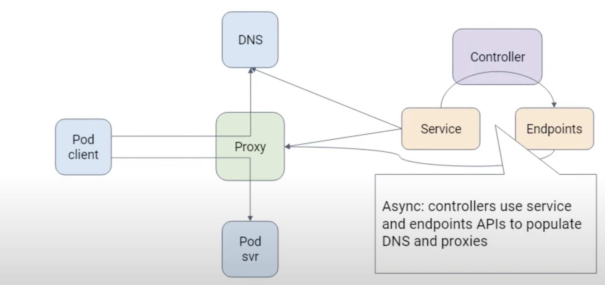 
   &nbsp;<br> 

# Helm 
* Helm is the package manager for Kubernetes, focused on automating the Kubernetes applications lifecycle in a simple and consistent way. 
* The objective of Helm is to make an easy and automated management (install, update, or uninstall) of packages for Kubernetes applications, and deploy them with just a few commands.