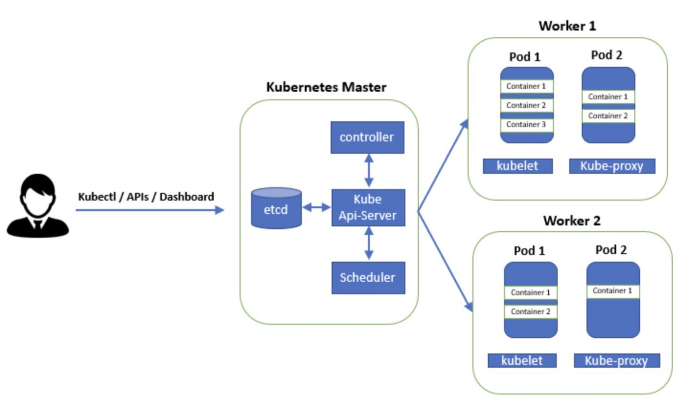

# Overview
* Kubernetes is an open source container orchestration platform that automates deployment, management and scaling of applications. 
* It is also known as “k8s”. K8s as an abbreviation results from counting the eight letters between the "K" and the "s"
* Kubernetes was first developed by engineers at Google before being open sourced in 2014. Later it is donated to CNCF(Cloud Native Computing Foundation)
* It is a descendant of Borg, a container orchestration platform used internally at Google.
* Kubernetes originates from Greek, meaning helmsman or pilot, hence the helm in the Kubernetes logo
* It is written in "Go Language" developed by Google.

# Container management tool:
* A tool that automates deploying, scaling & managing "containerized apllications" on a group of servers.
* Container management tools:
    - Kubernetes
    - Docker Swarm
    - Apache Mesos Marathon
    - Openshift
    - Hasicorp Nomad
* There are many cloud-based managed container orchestration tools: 
  - Google Kubernetes Engine (GKE)
  - AWS Elastic Kubernetes Service (EKS) 
  - Azure Kubernetes Service (AKS)

# Containerized Appliication:
* In containerization, a developer packages application along with all its dependencies, libraries and entire environment in a box called as container. 
* This then can be shipped using platform like docker & then it can be deployed on different systems.
* Advantage of this kind of deployment is because we know that application is available with all its environments & dependencies, so it will work fine on every system. So the issue that application running on one system & not on another is taken care by containerization. 
* So "Docker" is a tool designed to make it easier to deploy & run application by using containers & container allow developers to package their application along with all the libraries & dependencies & ship it as a single package.

# Why Kubernetes:
* We know the advantages of containerization, however in real time, large organizations use many containers for single application. There are hundreds & thousands of containers to ensure availibilty.
* We have to take care of- 
  - deploying application on multiple containers on multiple servers.
  - scheduling these deployments
  - Autoscaling
  - load-balancing
  - batch execution
  - rollbacks & 
  - monitoring
* All these process are very difficult to do manually. So to automate these processes, we have "container management tools".
* Among them "Kubernetes" is the most popular & widely used tool.

# Features of Kubernetes:
1. Automatic bin packing:
   - Let's take an example that we have five servers, each having 10 GB RAM & we have list of jobsto run on these servers. Every job is having different memory requirement.
   - Kubernetes helps us doing this. It will pack these jobs(containers) in bins(servers) in the most efficient way.
   - Kubernetes automatically places containers based on their resource requirements like CPU & memory while not sacrificing availibility of applications & it will also save the resources.
2. Service discovery & load-balancing: 
   - Kubernetes does not interact with containers directly. Instead it wraps one or more containers into a higher level structure called "Pod".
   - A Pod is having application container, storage & unique IP.
   - We can have multiple pods having same set of functions are abstracted into sets called "Services".
   - So single service can be run using multiple pods & therefore we have a service containing multiple pods & this service is given a DNS name by Kubernetes.
   - With this setup, K8s has complete control over networking and communication between pods and can also do teh load-balancing across them.
3. Storage orchestration: 
   - Single volume is shared among the containers running in a pod.
   - Kubernetes allow us to choose this volume. It can be from local storage or cloud storage like EBS or a network storage like NFS.

4. Self healing: 
   - In k8s, if the container fails, it will try to restart the container.
   - If a node fails, it replaces the node & reschedule the containers on new node. 
   - If container does not respond to teh user-defined health-check, it kills the container.

5. Automated rollouts & rollbacks: 
   - Rollout: deploying new changes to apllication or its configuration  
   - Rollback: just in case we have to revert those changes and restore the application to its previous state, it is calles as rollback
   - Kubernetes progressively rolls out changes to application or its configuration while monitoring health of application to ensure it  doesn't kill all your instances at the same time.
   - If something goes wrong, it will rollback. All this time of rollout or rollback, our apllication will be up. There will be no downtime. 
6. Secret & configuration management: 
   - Secret: It is an object that handles sensitive data like passwords, keys, tokens. 
   - Configmap: This object handles configurations 
   - Secret & configmap are created outside the pod.
   - As they are located outside & not coupled with pod or container, it makes them portable and easy to manage.
   - So with this feature, we can manage secrets& configurations separately from the image & it also helps to deploy & update secrets & configurations without rebuilding the image. 
7. Batch Execution: 
   - Batch job require an executable or process to be run to completion. 
   - In Kubernetes, run to completion jobs are primarily used for batch execution.
   - Each job creates one or more pods.
   - During job execution, if any pod or container fails, job controller will reschedule the container/pods to another node.
   - Once the job is completed, the pods will move from running to shut down state.

8. Horizontal scaling: 
   - In kubernetes, we can scale up & down the containers.
   - Scale up means to create more replicas of container if required & scale down means kill the container if these are not required.
   - There are 3 tools in k8s for horizontal scaling: Replication Controller, manifest file, horizontal pod autoscaler.
   - Replication controller is a structure that enables to create multiple pods, then makes sure that number of pods always exist.
   - In case, if any pod crashes, the replication controller replaces it.
   - Replication controller gets the no. of pods to create & make available always from a file called as manifest.
   - In manifest file, there is a property called "replicas" & there is a count there. So if we configure as "replicas:3", the replication controller create 3 replicas of the pod & will ensure that the desired no. of pods are always maintained.
   - We have another structure called horizontal pod autoscaler. It will monitor the CPU utilization & based on this matrix it sets the no. of pods required & based on that, replication controller will maintain that no. of pods. 

# Architecture of Kubernetes: 
* In Kubernetes, we have a master & worker nodes. Together they form a team called "Cluster".
* When we deploy kubernetes we actuallyget a cluster & cluster is made of set of machines called nodes.
* A cluster has atleast one master & one worker node. There can be more than one master nodes in a cluster to provide features of failover & high availability.
* A node can be a physical machine or virtual machine or a VM on cloud. Nodes are having pods inside & pods having container.

* **Master** : 
  - It is responsible for managing the cluster. 
  - It monitors nodes & pods in cluster.
  - When a node fails, it moves workload of failed node to another worker node.
  - Components of Master:
    1. API Server: 
       - It is responsible of all communication. 
       - It is front end for the kubernetes control plane.
       - API server exposes some APIs so that the users can interact with server. 
       - To call the APIs we can use command line tool or User Interface.
       - "kubectl" is command line tool. Users interact with API using kubectl.
    2. Schedular: 
       - It schedules pods across worker nodes. 
       - As we know, nodes are physical or virtual machines with different configuration. Schedular knows this configuration & whenever it has to schedule a pod, it will check which node filts best for the configuration of pod & accordingly it will schedule the pod on the required node.
    3. Controller Manager:
       - It is responsible for health of the cluster. 
       - It monitors health of the nodes & ensures nodes are running all the time.
       - It also ensures that the correct no. of pods are running as per the specifications file.
       - There are four controllers: Node controller, Replication controller, Endpoints controller, Service account & token controller. 
       - Controller continuously compare cluster's desired state to its current state. In case any mismatch, corrective action is taken by the controller until current state matches the desired state.  
    4. ETCD: 
       - It is an open-source, distributed key-value data store.
       - Only API server can interact with ETCD directly. 
       - It is highly available, key-value store and used as kubernetes backing store for all cluster data. 

* **Worker Node**: 
  - It is a physical or virtual machine where containers are deployed. 
  - Every node should run a container runtime like Docker.
  - Components of worker-node:  
    1. Kubelet: 
       - Each worker node includes a kubelet, an agent that communicates with the master to ensure the containers in a pod are running. 
       - When the master requires a specific action happen in a node, the kubelet receives the pod specifications through the API server and executes the action. It then ensures the associated containers are healthy and running.
    2. kube-proxy: 
       - It is a core networking component of worker node. 
       - It can interact with the external world as well.
       - It is reponsible for maintaining network configuration and rules on node.
    3. Container runtime: 
       - The container runtime is the software that is responsible for running containers. 
       - Kubernetes supports container runtimes such as Docker, containerd, CRI-O, Rocketlet etc.
       - The most commonly used platform is Docker. 

    
      
   