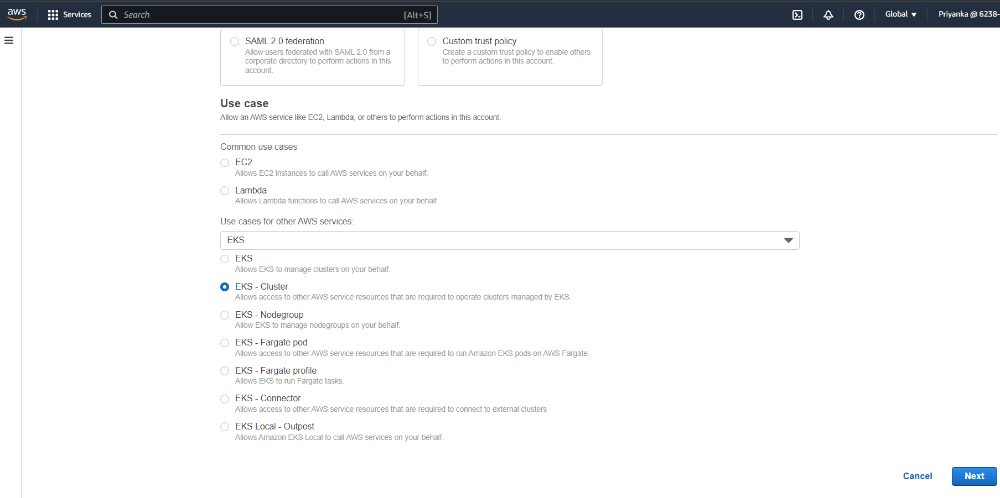

# Deploy Workloads on EKS Cluster using Lens
## Objective
* In this tutorial, we will deploy workloads on Amazon EKS cluster using Lens IDE. 
* We will use RDS as database for this service.

## Prerequisites
* An AWS account
* Lens Desktop installed on your system. If you don't have Lens, please follow steps to install it documented [here](../minikube/Lens-minikube.md) 

## Create an EKS Cluster
1. Login to your AWS Account (either as a `root` user or as an `IAM User` with sufficient permissions).
2. In `services`, search for `Elastic Kubernetes Service`. 
3. On EKS dashboard, Click on `Add Cluster` --> `Create`.
4. On `Configure cluster` page, specify name of cluster, select desired version of kubernetes and cluster service role. Here we need to create a new IAM role to associate with cluster. To do so: 
    - Go to `IAM` service.
    - Click on `Roles` --> `Create role`.
    - On the next page, select `AWS service` under Trusted entity type. Then under `Use case`, browse for `EKS`. Select `Eks Cluster`. Click on `Next`.
     
     &nbsp;  
    - Here you may see that `AmazonEKSClusterPolicy` is already added to the role. Click on `Next`. 
    - Enter a name for this role. Review and create role.
    - We need to add one more policy to this role i.e. RDS access policy. For that click on created role. Under `Permissions` tab, click on `Add Permissions` --> `Attach Policies`. 
    - On next page, select `AmazonRDSFullAccess` policy and attach it to the role.
5. Go to EKS dashboard, assign created role to our EKS cluster. Click on `Next`.
6. Specify networking here. Select your VPC and subnets and security group for cluster. Here we have to create a security group for cluster. For that: 
- Open EC2 dashboard. Click on `Security groups` under `Network and security` section. 
- Click on `Create security group`.
- On the next page, specify name and description of security group. 
- Under `Inbound rules` section, click on `Add rule`. 
- Allow all traffic fron anywhere. Select `All traffic` type and destination `Anywhere IPV4`. And `Create security group`.

7. Assign this created security group to the cluster. 
8. Choose cluster IP family `IPV4`. make Cluster Endpoint access `Public`. Click `Next`. On the next page, don't configure any logging. Just click on `Next`.
9. On the next page, keep default add-ons and click on `Next`.
10. Review and create cluster.
