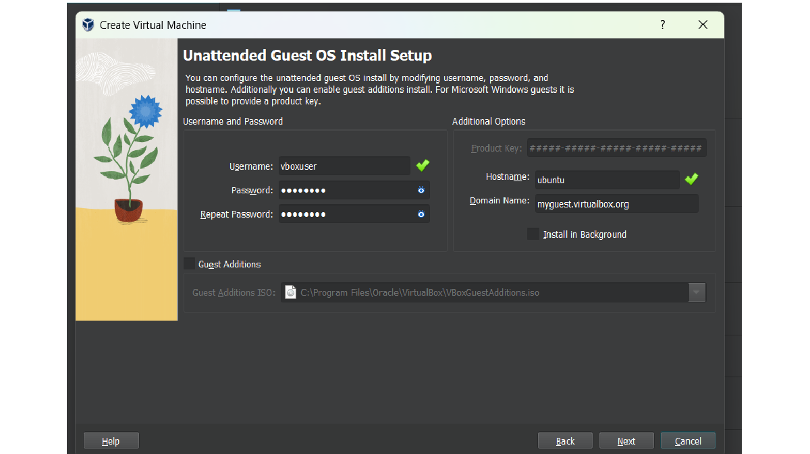
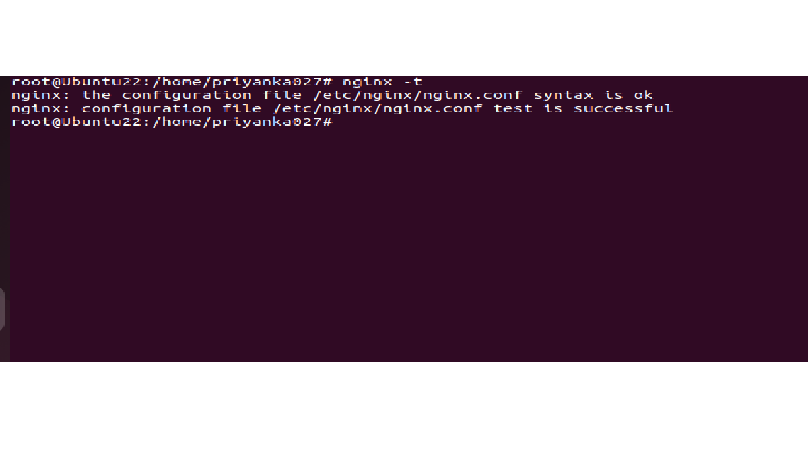

# Introduction To NGINX

- NGINX is an open-source software for web serving, reverse-proxying, caching, load balancing & media streaming.
- It is a high performance web server developed to facilitate the increasing needs of the modern web. It focuses on high performance, high concurrency, and low resource usage.
- In its initial release, NGINX functioned for HTTP web serving. Today, however, it also serves as a reverse proxy server for HTTP, HTTPS, SMTP, IMAP, POP3 protocols, on the other hand, it is also used for HTTP load balancer, HTTP cache, and email proxy for IMAP, POP3, and SMTP.

# Why NGINX

- NGINX is fast.
- Accelerates your application
- Has load balancers
- Affordable to install and maintain
- Easy to use
- Can get upgraded on fly
- Scaling capability
- Few resources requirement & consumption
- Multiple protocol support: HTTP, HTTPS, WEBSOCKET, IMAP, POP3, SMTP
- Video streaming using MP4/FLV/HDS/HLS
- Live streaming

# Architecture of NGINX

NGINX uses a predictable process model that is tuned to the available hardware resources:

- The **master** process performs the privileged operations such as reading configuration and binding to ports, and then creates a small number of child processes (the next three types).
- The **cache loader** process runs at startup to load the disk based cache into memory, and then exits. It is scheduled conservatively, so its resource demands are low.
- The **cache manager** process runs periodically and prunes entries from the disk caches to keep them within the configured sizes.
- The **worker** processes do all of the work! They handle network connections, read and write content to disk, and communicate with upstream servers.

# Install NGINX

1.  Install Oracle VM Virtualbox. (Download it from https://www.virtualbox.org , according to your OS.)
2.  Download Ubuntu ISO desktop image from https://ubuntu.com/download/desktop. (Download LTS version).
3.  Inside Virtualbox, click on New. You will see following screen.

    

        - Give proper name to your VM in 'Name' field.
        - Select downloaded Ubuntu ISO image at “ISO Image” field.
        - Click on Next

    &nbsp; 

4.  You will see thr screen as :

    

        - Give Username & password of your choice. Click on Next

    &nbsp; 

5.  Next you have to configure your VM’s hardware configs.

    

        - Select at least 2GB RAM & 1 Processor. Click on Next.
        - Select Create a Virtual Hard Disk. Click Next & Finish

    &nbsp; 

6.  Then go to Settings tab => Network => Adapter1 => Select Bridged Adapter
    

&nbsp;  7. Start VM & login with password. 8. Update VM with `sudo apt-get update`. (You may continue with existing user or switch to root user using `su root` & enter password. If root user you need not to write “sudo” keyword before every command.) 9. Install NGINX using `apt-get install nginx` command.

- Once completed, check version using `nginx -v`.
- You may also check in browser whether nginx is installed properly on your VM using following steps:
  - Check IP address of your VM using “ip addr” command.
  - Hit this IP in the browser & you may get response like:

 

&nbsp; 

- Check status of Nginx service using `systemctl status nginx`(or `service nginx status`).
- If inactive, start Nginx service using `systemctl start nginx`.
- To check processes running on Nginx use `ps aux | grep nginx`. It will display master & no. of worker processes running.
- To see and change configurations check nginx.conf file using `vi /etc/nginx/nginx.conf`.
- Use the following command to test the Nginx configuration for any syntax or system errors:
  `nginx -t`
  The output will look something like this:
  
  &nbsp; 

# NGINX Directives & Contexts

- Configuration options in Nginx are known as directives.
- Nginx consists of modules that are controlled by directives defined in the configuration file.
- Directives are divided into two parts:
  1. **Simple Directive**:
     A simple directive consists of the name and parameters separated by spaces and ends with a semicolon ( ; )
  2. **Block Directive**:
     The structure of block directive is similar to the simple directive, but instead of semicolon, it ends with a set of additional instructions surrounded by curly braces ({ and }).
     If a block directive can have other directives inside the braces, then it is known as context. Eg. Events, http, location, and server.
- In Nginx configuration file, we will notice that the configurations are organized in a tree-like structure surrounded by curly braces i.e. "{" and "}". These locations surrounded by braces is called **context** for placing configuration directive.
- This is the section where we can declare directives. It is similar to the scope in a programming language.
- Context can be nested within other contexts, creating a context hierarchy.
- Types of contexts:
  - **Main/ Global Context**:
    - The main context is placed at the beginning of the core Nginx configuration file. The directives for this context cannot be inherited in any other context and therefore can't be overridden.
    - The main context is used to configure details that affect the entire application on a basic level. Some common details that are configured in the main context are the user and group to run the worker processes as, the total number of workers, and the file to save the main process ID. The default error file for the entire application can be set at the main context level.
  - **Events Context**:
    - The events context sets global options for connection processing. There can be only one event context defined within Nginx configuration.
    - Nginx uses an event-based connection processing model, so the directive defined within this context determines how worker processes should handle connections.
  - **HTTP context**:

    - The HTTP context is used to hold the directives for handling HTTP or HTTPS traffic.

  - **Server Context**:
    - The server context is declared within the http context.
    - The server context is used to define the Nginx virtual host settings.
    - There can be multiple server contexts inside the HTTP context.
    - The directives inside the server context handle the processing of requests for resources associated with a particular domain or IP address.
  - **Location Context**:
    - It define directives to handle the request of the client. When any request for resource arrives at Nginx, it will try to match the URI (Uniform Resource Identifier) to one of the locations and handle it accordingly.
    - Multiple location contexts can be defined within the server blocks. Moreover, a location context can also be nested inside another location context.
- Directives placed in the configuration file outside of any contexts are considered to be in the main context.
- The 'events' and 'http' directives reside in the 'main' context, 'server' resides in 'http' and 'location' in the 'server' context.

# Understanding Configuration File
