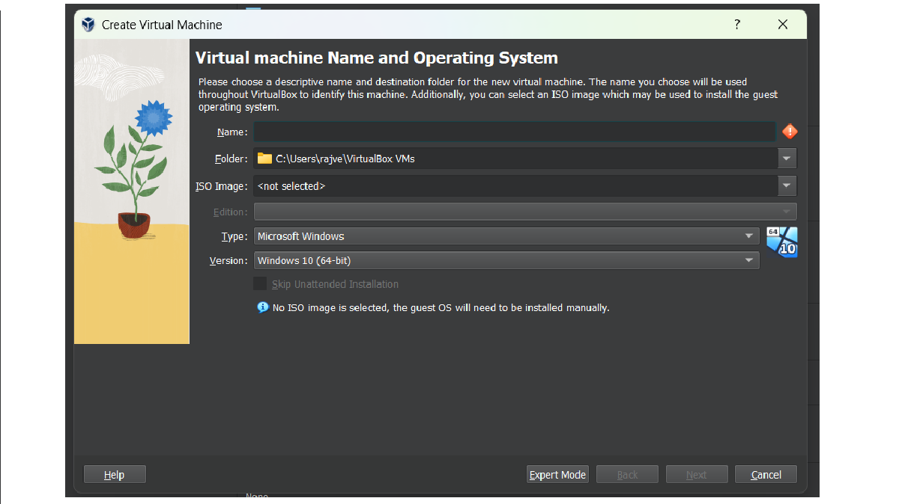
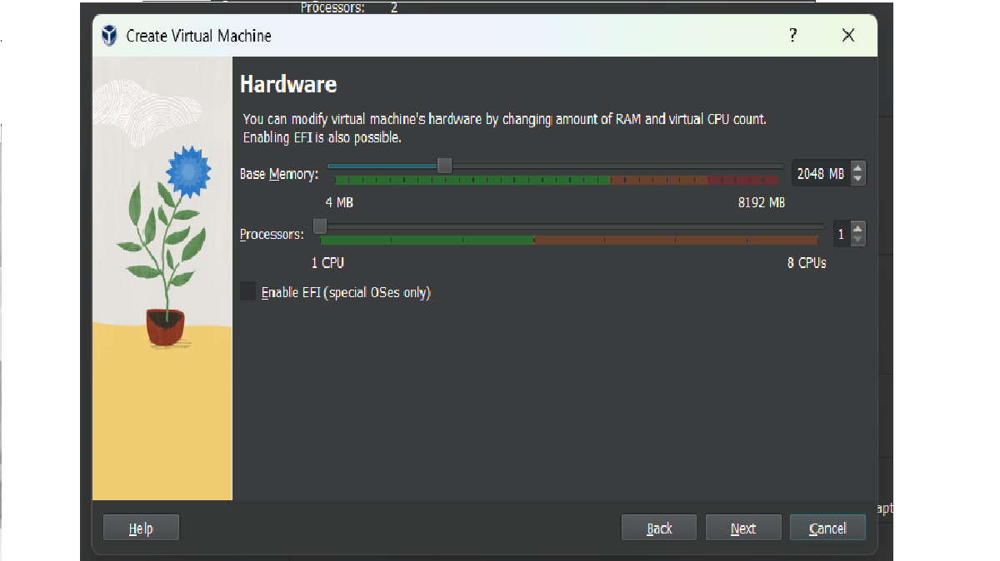
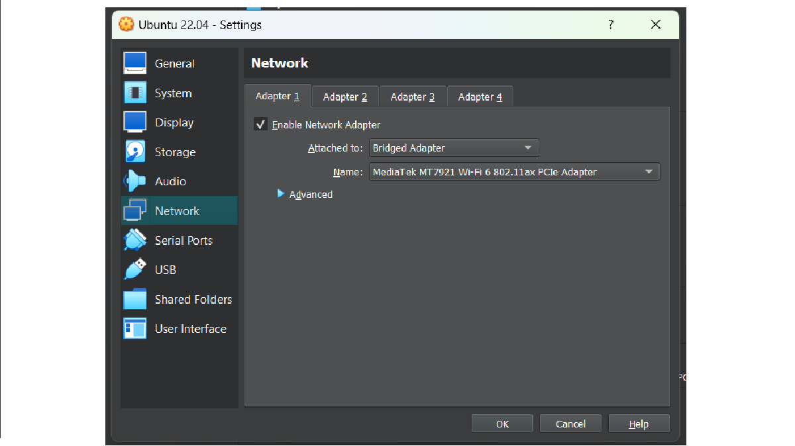

# Introduction To NGINX

- NGINX is an open-source software for web serving, reverse-proxying, caching, load balancing & media streaming.
- It is a high performance web server developed to facilitate the increasing needs of the modern web. It focuses on high performance, high concurrency, and low resource usage.
- In its initial release, NGINX functioned for HTTP web serving. Today, however, it also serves as a reverse proxy server for HTTP, HTTPS, SMTP, IMAP, POP3 protocols, on the other hand, it is also used for HTTP load balancer, HTTP cache, and email proxy for IMAP, POP3, and SMTP.

# Why NGINX

- NGINX is fast.
- Accelerates your application
- Has load balancers
- Affordable to install and maintain
- Easy to use
- Can get upgraded on fly
- Scaling capability
- Few resources requirement & consumption
- Multiple protocol support: HTTP, HTTPS, WEBSOCKET, IMAP, POP3, SMTP
- Video streaming using MP4/FLV/HDS/HLS
- Live streaming

# Architecture of NGINX

   

NGINX uses a predictable process model that is tuned to the available hardware resources:

- The **master** process performs the privileged operations such as reading configuration and binding to ports, and then creates a small number of child processes (the next three types).
- The **cache loader** process runs at startup to load the disk based cache into memory, and then exits. It is scheduled conservatively, so its resource demands are low.
- The **cache manager** process runs periodically and prunes entries from the disk caches to keep them within the configured sizes.
- The **worker** processes do all of the work! They handle network connections, read and write content to disk, and communicate with upstream servers.

# Install NGINX

1.  Install Oracle VM Virtualbox. (Download it from https://www.virtualbox.org , according to your OS.)
2.  Download Ubuntu ISO desktop image from https://ubuntu.com/download/desktop. (Download LTS version).
3.  Inside Virtualbox, click on New. You will see following screen.

     

        - Give proper name to your VM in 'Name' field.
        - Select downloaded Ubuntu ISO image at “ISO Image” field.
        - Click on Next

    &nbsp;<br>

4.  You will see thr screen as :

    

        - Give Username & password of your choice. Click on Next

    &nbsp;<br>

5.  Next you have to configure your VM’s hardware configs.

    

        - Select at least 2GB RAM & 1 Processor. Click on Next.
        - Select Create a Virtual Hard Disk. Click Next & Finish

    &nbsp;<br>

6.  Then go to Settings tab => Network => Adapter1 => Select Bridged Adapter
    
    &nbsp;<br>
    
7.  Start VM & login with password. 
8.  Update VM with `sudo apt-get update`. (You may continue with existing user or switch to root user using `su root` & enter password. If root user you need not to write “sudo” keyword before every command.) 
9.  Install NGINX using `apt-get install nginx` command.

- Once completed, check version using `nginx -v`.
- You may also check in browser whether nginx is installed properly on your VM using following steps:

  - Check IP address of your VM using “ip addr” command.
  - Hit this IP in the browser & you may get response like:

   

&nbsp;<br>

- Check status of Nginx service using `systemctl status nginx`(or `service nginx status`).
- If inactive, start Nginx service using `systemctl start nginx`.
- To check processes running on Nginx use `ps aux | grep nginx`. It will display master & no. of worker processes running.
- To see and change configurations check nginx.conf file using `vi /etc/nginx/nginx.conf`.
- Use the following command to test the Nginx configuration for any syntax or system errors:
  `nginx -t`
  The output will look something like this:

  
  &nbsp;<br>

8. Check firewall status.

- Use `ufw status` to check whether firewall is active or not. If inactive use `ufw enable` to enable firewall.
- “ufw app list” lists firewall rules.

   

- `ufw allow Nginx Full` allows both HTTP & HTTPS rules.
- The syntax to list all the current rules in a numbered list format: `ufw status numbered`.

# NGINX Directives & Contexts

- Configuration options in Nginx are known as directives.
- Nginx consists of modules that are controlled by directives defined in the configuration file.
- Directives are divided into two parts:
  1. **Simple Directive**:
     A simple directive consists of the name and parameters separated by spaces and ends with a semicolon ( ; )
  2. **Block Directive**:
     The structure of block directive is similar to the simple directive, but instead of semicolon, it ends with a set of additional instructions surrounded by curly braces ({ and }).
     If a block directive can have other directives inside the braces, then it is known as context. Eg. Events, http, location, and server.
- In Nginx configuration file, we will notice that the configurations are organized in a tree-like structure surrounded by curly braces i.e. "{" and "}". These locations surrounded by braces are called **context**.
- This is the section where we can declare directives. It is similar to the scope in a programming language.
- Context can be nested within other contexts, creating a context hierarchy.
- Types of contexts:

  - **Main/ Global Context**:
    - The main context is placed at the beginning of the Nginx configuration file. The directives for this context cannot be inherited in any other context and therefore can't be overridden.
    - The main context is used to configure details that affect the entire application on a basic level. Some common details that are configured in the main context are the user and group to run the worker processes as, the total number of workers, and the file to save the main process ID. The default error file for the entire application can be set at the main context level.
  - **Events Context**:
    - The events context sets global options for connection processing. There can be only one event context defined within Nginx configuration.
    - Nginx uses an event-based connection processing model, so the directive defined within this context determines how worker processes should handle connections.
  - **HTTP context**:

    - The HTTP context is used to hold the directives for handling HTTP or HTTPS traffic.

  - **Server Context**:
    - The server context is declared within the http context. There can be multiple server contexts inside the HTTP context.
    - It is used to define the Nginx virtual host settings.
    - The directives inside the server context handle the processing of requests for resources associated with a particular domain or IP address.
  - **Location Context**:
    - It defines directives to handle the request of the client. When any request for resource arrives at Nginx, it will try to match the URI (Uniform Resource Identifier) to one of the locations and handle it accordingly.
    - Multiple location contexts can be defined within the server blocks. A location context can also be nested inside another location context.

- Directives placed in the configuration file outside of any contexts are considered to be in the main context.
- The 'events' and 'http' contexts reside in the 'main' context, 'server' resides in 'http' and 'location' in the 'server' context.

# Understanding Configuration File

Here is an example of nginx.conf file:

  

&nbsp;<br>

- The first three lines of the file are in main/global context.

  - Here, the first directive i.e. `worker_processes auto;` shows how many worker processes are running. You may change it by replacing "auto" with your desired value.
  - The PID file stores the main process ID of the nginx process

- The “events” context is contained within the “main” context. `worker_connections` directive in events context tells how many max. connections a worker process can have

- When configuring Nginx as a web server or reverse proxy, the “http” context will hold the majority of the configuration. This context will contain all of the directives and other contexts necessary to define how the program will handle HTTP or HTTPS connections.

  - Some of the directives that are defined in http contexts are: control the default locations for access and error logs (access_log and error_log), configure asynchronous I/O for file operations (aio, sendfile, and directio), and configure the server’s statuses when errors occur (error_page).
  - Other directives configure compression (gzip and gzip_disable), the rules that Nginx will follow to try to optimize packets and system calls (sendfile, tcp_nodelay, and tcp_nopush).
  - Additional directives configure an application-level document root and index files (root and index) and set up the various hash tables that are used to store different types of data (_\_hash_bucket_size and _\_hash_max_size for server_names, types, and variables).

- The “server” context is declared within the “http” context. The reason for allowing multiple declarations of the server context is that each instance defines a specific virtual server to handle client requests. You can have as many server blocks as you need, each of which can handle a specific subset of connections.

  - The directives which decide if a server block will be used to answer a request are:

    - **listen**: The ip address / port combination that this server block is designed to respond to. If a request is made by a client that matches these values, this block will potentially be selected to handle the connection.
    - **server_name**: This directive is the other component used to select a server block for processing. If there are multiple server blocks with listen directives of the same specificity that can handle the request, Nginx will parse the “Host” header of the request and match it against this directive.

- The next context is the location context. Multiple location contexts can be defined, each location is used to handle a certain type of client request, and each location is selected by virtue of matching the location definition against the client request through a selection algorithm. Location blocks live within server contexts and, unlike server blocks, can be nested inside one another.

# Deploy a static web-application using NGINX

- Let's create a simple web-app containing simple HTML file which will display "Welcome" message on webpage & deploy it using NGINX.
- Following are the steps for it:

1. Create single page web-application:

   - Create new directory using `mkdir webapp`.
   - Change directory to webapp using `cd webapp` & create new file “index.html” using `vi index.html`.
   - Write simple html code. For example:

   ```
     <html>
     <body>
     <h1> Welcome to my website </h1>
     </body>
     </html>
   ```

   - After writing html code, press esc then :wq! to save the file & quit.

2. Create config file for webapp inside /etc/nginx/conf.d directory using `vi webapp.conf` (.conf extension indicates it is a configuration file).

   - Write following context inside conf file:

   ```
    server {
        listen      80;
        server_name Ip address;

        location / {
          root  location of your web-app;
          index index.html;
       }

        error_page 500 502 503 504 /50x.html;
        location = /50x.html {
           root  /usr/share/nginx/html;
        }

    }
   ```

3. Check nginx.conf file for “include /etc/nginx/conf.d/\*.conf”. It indicates that nginx will consider all “.conf” files inside conf.d directory as configuration files while running applications.

  
&nbsp;<br>

4. Once all configurations have been done, test config file for syntax error if any using `nginx -t` command.

5. After successful, restart nginx service using `systemctl restart nginx` & check master & worker processes are running or not, using `ps aux | grep nginx`.
6. If everything is fine, check your application by running it locally using `lynx http://IP address of VM`. (If 'lynx' is not installed on your VM, get it using `apt-get install lynx`)
7. You may also check it in browser by hitting our VM’s IP address.

  

&nbsp;<br>

  

# Forward and reverse proxy

- A proxy server, sometimes referred to as a **forward proxy**, is a server that routes traffic between client(s) and another system, usually external to the network. By doing so, it can regulate traffic according to preset policies, convert and mask client IP addresses, enforce security protocols, and block unknown traffic.
- A **reverse proxy** is a type of proxy server. Unlike a traditional proxy server, which is used to protect clients, a reverse proxy is used to protect servers. Reverse proxy enables computers on internet to access resources on a private network.


# Deploy a node.js based web app using NGINX:

- Here, we will create a javascript file configured as a http server & deploy it using NGINX.
- We need to follow these steps:

1. Install node.js on VM using `apt-get install nodejs`. Once completed the installation, check whether it is properly installed by using `node -v`. It returns node version you have installed.
2. Create a new folder inside which create a javascript file 'main.js'
3. Inside 'main.js'we will write following lines of code:

```
var http = require('http');
http.createServer(function(req,res){
  res.writeHead(200,{'Content-Type':'text/plain'});
      res.end('Welcome to Webapp-1');
}).listen(8001);

console.log('Server 1 is running on port 8001');

```

4. Run this application using “node main.js”. You may check in the browser by hitting 'IP of VM:8001'.
5. Stop the application & create a config file inside /etc/nginx/conf.d folder. `vi nodeapp.conf` using upstream mediator as:

```
upstream app {
    server  VM’s IP address:8080;
}
server {
    listen      80;
    server_name VM’s IP address;

    location / {
      proxy_pass http://app;
    }
}

```

6. Once done, save the file & quit. Check conf syntax using `nginx -t`.
7. If successful, restart the nginx service. Also run the main.js file.
8. Check using lynx or curl `curl VM’s IP`. You will get response of node.js based application. You may also check this in browser by hitting VM’s IP.


&nbsp;<br>

**Note**: Hosting dynamic website using NGINX is not possible. It will use proxying to host dynamic content.


&nbsp;<br>

- In this application, we have used “upstream” for proxying.

# Loadbalancer

- A load balancer is a device that acts as a reverse proxy and distributes network or application traffic across a number of servers.
- Load balancers are used to increase capacity and reliability of applications.
- They improve the overall performance of applications by decreasing the burden on servers associated with managing and maintaining application and network sessions, as well as by performing application-specific tasks.
- Algorithms used by loadbalancers:
  - Round robin
  - Weighted round robin
  - Least connections
  - Least response time

# Configure NGINX as a loadbalancer

- Following are the steps to configure NGINX as a loadbalancer.

1. Create two node.js based web servers listening to two different ports. Let’s say port 8001 & 8002. Check both the application by running them locally as well as on the browser.
2. Create a conf file inside /etc/nginx/conf.d folder named “lb.conf” & write following contexts:

```
upstream load1 {
        server IP address of VM:8001;
        server IP address of VM:8002;
}

server {
        listen   80;
        server_name IP address of VM;

        location / {
                proxy_pass http://load1;
        }
}

```

3. Once finished, save & quit file. Check the conf file syntax using `nginx -t`.
4. Restart nginx service using `systemctl restart nginx`. Run both node applications.
5. Check response locally using `curl IP address of VM` (or `lynx http://IP address of VM`).


&nbsp;<br>


&nbsp;<br>

6. Also check in the browser by hitting IP address of VM. Try reloading the page. You may see that once it is giving response from 1st node server & next time from 2nd server.


&nbsp;<br>


&nbsp;<br>

7. **Note**: This type of loadbalancer is called as simple loadbalancer. It is using Round Robin algorithm.
8. To make it weighted loadbalancer, just change upstream context as follows:

```
upstream load1 {
    server IP address of VM:8001;
    server IP address of VM:8002 weight=2;
 }

```

9. It will take 1st server’s weight=1 by default. It indicates that 2nd server has double capacity to serve client requests, so loadbalancer sends more requests to 2nd server.

# Set-up NGINX server blocks (virtual hosts)

- When using the Nginx web server, server blocks (similar to virtual hosts in Apache) can be used to encapsulate configuration details and host more than one domain on a single server.
- Following are steps to host domains on NGINX server:

1.  Login as root & give sudo privileges to non-root user we are going to use for this lab using `usermod -aG sudo <username>` command. (If your user is already added to sudo group, skip this step)
2.  Setup new document root directories –

    - By default, Nginx on Ubuntu 16.04 has one server block enabled. It is configured to serve documents out of a directory at /var/www/html.
    - This works well for a single site, we need additional directories if we’re going to serve multiple sites. We can consider the /var/www/html directory the default directory that will be served if the client request doesn’t match any of our other sites.
    - We will create a directory structure within /var/www for each of our sites. The actual web content will be placed in an html directory within these site-specific directories.
    - `sudo mkdir -p /var/www/example.com/html`,
      `sudo mkdir -p /var/www/test.com/html`
      The -p flag tells mkdir to create necessary parent directories.

3.  Reassign ownership of these directories to our normal user with sudo privileges.

    - `sudo chown -R $USER:$USER /var/www/example.com/html`
    - `sudo chown -R $USER:$USER /var/www/test.com/html`

4.  Change permissions of root directories by `sudo chmod -R 755 /var/www` command.
5.  Create sample pages for each site. - Create an index.html file in your first domain:
    `vi /var/www/example.com/html/index.html` - Inside the file, we’ll create a really basic file that indicates what site we are currently accessing.
    
    &nbsp;<br>

        - Repeat these steps for second domain too. Just replace "example.com” with “test.com”

6.  Create Server block files for each domain:

    - By default, Nginx contains one server block called default which we can use as a template for our own configurations.
      `sudo cp /etc/nginx/sites-available/default /etc/nginx/sites-available/example.com`

          `sudo vi /etc/nginx/sites-available/example.com`

    - Inside the file modify server block as:

      ```
      server{
          listen 80;
          listen [::]:80;

          root var/www/example.com/html;
          index index.html index.htm index.nginx-debian.html;

          server_name example.com www.example.com;

          location / {
            try_files $uri $uri/ = 404;
          }
      }
      ```

    - Follow similar steps for second domain as well by replacing “example.com” with “test.com”

7.  Enable your server blocks using following commands:
    `sudo ln -s /etc/nginx/sites-available/example.com /etc/nginx/sites-enabled/`,
    `sudo ln -s /etc/nginx/sites-available/test.com /etc/nginx/sites-enabled/`

8.  In order to avoid a possible hash bucket memory problem that can arise from adding additional server names, we will also adjust a single value within our /etc/nginx/nginx.conf file. Open the file. Within the file, find the "server_names_hash_bucket_size 64” directive. Remove the # symbol to uncomment the line. Save & close the file.
9.  Modify local hosts file for testing: `sudo vi /etc/hosts`
    You need to know your server’s public IP address and the domains you want to route to the server. Let server’s public IP address is 192.168.29.157, the lines we would add to file would look something like this:

   
&nbsp;<br>

10. Save & close file. Restart NGINX by using `sudo systemctl restart nginx`.

11. Test your results locally using `lynx http://example.com.` And `lynx http://test.com`


&nbsp;<br>


&nbsp;<br>

12. You may also test results using browser:


&nbsp;<br>


&nbsp;<br>
