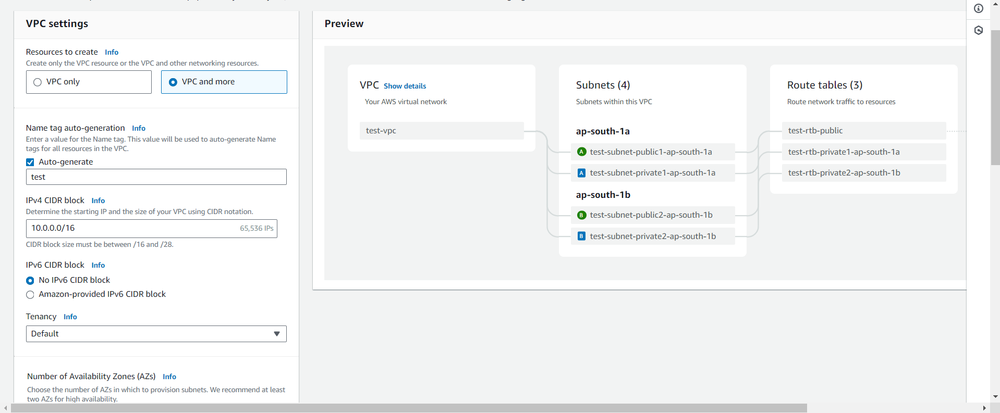

# Accessing AWS EC2 Instance from VS Code using Remote-SSH Extension

This guide will walk you through the process of creating a VPC, launching an EC2 instance, and accessing it from VS Code to run and debug your service using the Remote-SSH extension.

## Prerequisites
- AWS account
- AWS CLI installed and configured
- VS Code installed
- Remote-SSH extension installed in VS Code
- SSH key pair (for EC2 access)

## Step 1: Create a VPC
1. **Open AWS Management Console** and navigate to the **VPC Dashboard**.
2. Click on **Create VPC**.
3. Choose **VPC and more**.
4. Enter the following details: Refer to the image for preview
   - **Name tag**: `test`
   - **IPv4 CIDR block**: `10.0.0.0/16`
   - Leave other fields as default.
   
5. Click **Create VPC**.

## Step 2: Launch an EC2 Instance
1. Navigate to the **EC2 Dashboard**.
2. Click **Launch instance**.
3. Choose an Amazon Machine Image (AMI), e.g., **Ubuntu Server 22.04 LTS**.
4. Choose an instance type, e.g., **t2.micro** (free tier eligible) or as per your requirements of vCPU and memory.
>**Note**: If your instance is not as per your service's CPU and memory requirements, your ssh connection gets disconnected frequently due to heavy load on server.

5. Click **Next: Configure Instance Details**.
6. Enter the following details:
   - **Network**: `test-vpc`
   - **Subnet**: `test-vpc-public-subnet`
   - **Auto-assign Public IP**: `Enable`
7. Click **Next: Key pair**.
8. If you are already having a key-pair, you can use it or create a new key-pair and download it at safe place as it will require for logging into the instance later.
9. Click **Next: Configure Security Group**.
10. Create a new security group:
    - **Security group name**: `test-server-security-group`
    - **Type**: `SSH`
    - **Protocol**: `TCP`
    - **Port Range**: `22`
    - **Source**: `My IP` or `0.0.0./0`
    - You may add security group rules as per your requirement. e.g. port 80, 443, or your service port.
11. Click **Next: Add Storage**.
12. Adjust storage if needed and click **Next: Add Tags**.
13. Click **Review and Launch**.
14. Click **Launch** and choose an existing key pair or create a new one.
15. Click **Launch Instances**.

## Step 3: Connect to EC2 Instance using SSH
1. Open a terminal.
2. Use the following command to connect to your instance:
   ```sh
   ssh -i /path/to/your-key-pair.pem ec2-user@<your-ec2-public-ip>
   ```
3. Install all packages required for your service to run. e.g., `git`-to clone GitHub repository, `NodeJs` etc.

## Step 4: Configure VS Code for Remote - SSH
1. Open VS Code.
2. Install the **Remote - SSH** extension if not already installed.
3. Open the command palette (`Ctrl+Shift+P`) and select **Remote-SSH: Connect to Host...**.
4. Select `configure SSH hosts`
5. Select config file. e.g. `C:\User\.ssh\config` and add folowing details to it and save.
   ```
   Host remote-test-server
   HostName <public-ip-of-your-instance>
   User ubuntu
   IdentityFile "/path/to/your-key-pair.pem"
   ```
5. Open the command palette (`Ctrl+Shift+P`) again and select **Remote-SSH: Connect to Host...** and select the added SSH host to connect.

## Step 8: Set Up Your Development Environment
1. Once connected, open a terminal in VS Code.
2. Open your project folder.
3. Install any necessary dependencies or software required for your service.
4. Add necessary files. e.g. `.env` or other config files.
5. Start coding.

## Step 9: Run and Debug Your Service
1. Use the terminal to start your service.
2. Set up debugging configurations by creating a `launch.json` file in the `.vscode` folder.
3. Start debugging using the **Run and Debug** tab in VS Code.

You're now ready to develop, run, and debug your service on your AWS EC2 instance using VS Code!

## Conclusion
This guide covers the essential steps to set up and access an AWS EC2 instance from VS Code using the Remote-SSH extension.