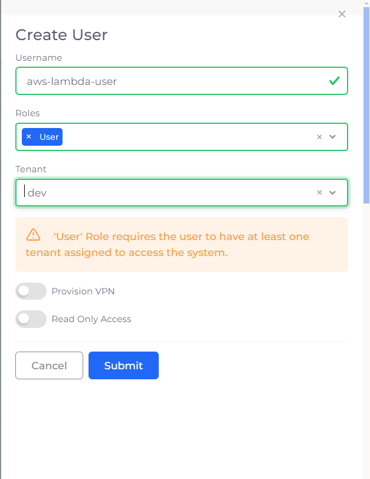

## Steps For Generating Duplo API-Token

1. Login to Duplocloud platform.
2. Go to `Administrator` --> `Users` --> `Add` to add a generic user.
3. Fill all the details as shown in following image.

4. Click on `Submit`.
5. Then select created user. Move to `Tokens` tab. Click on `Add`.
6. Give appropriate name to the token and click on `Create`.
7. Copy the generated token and keep it somewhere safe as it will not be displayed again.

