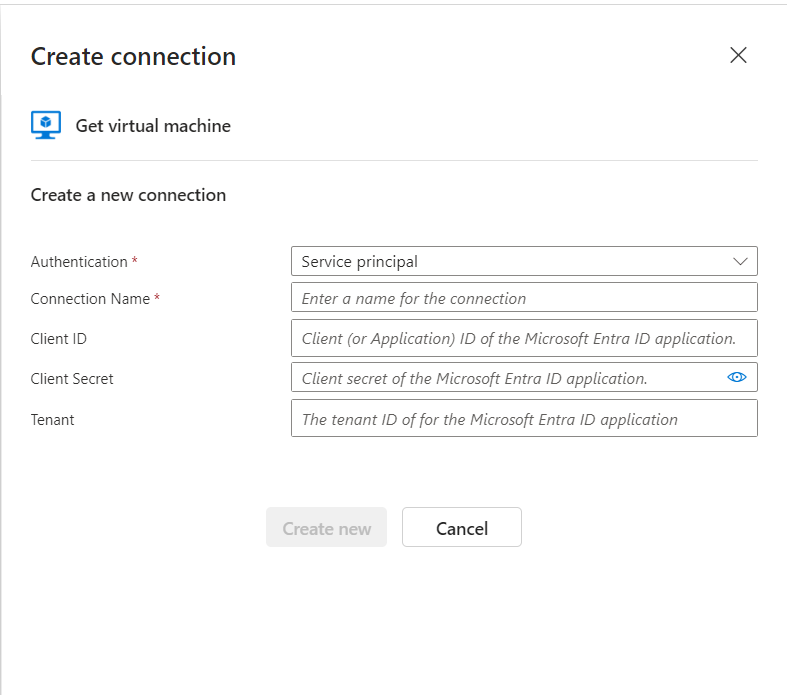
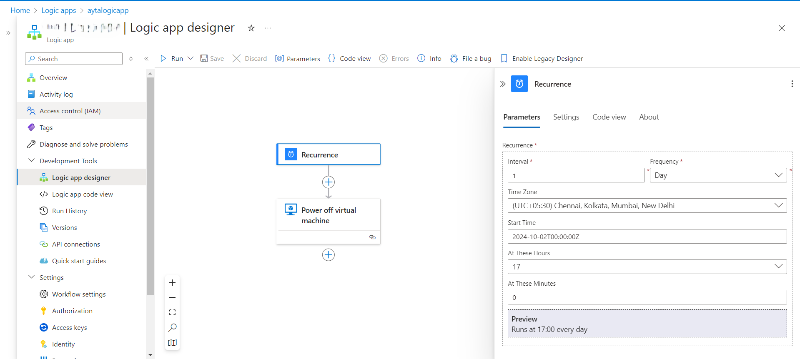
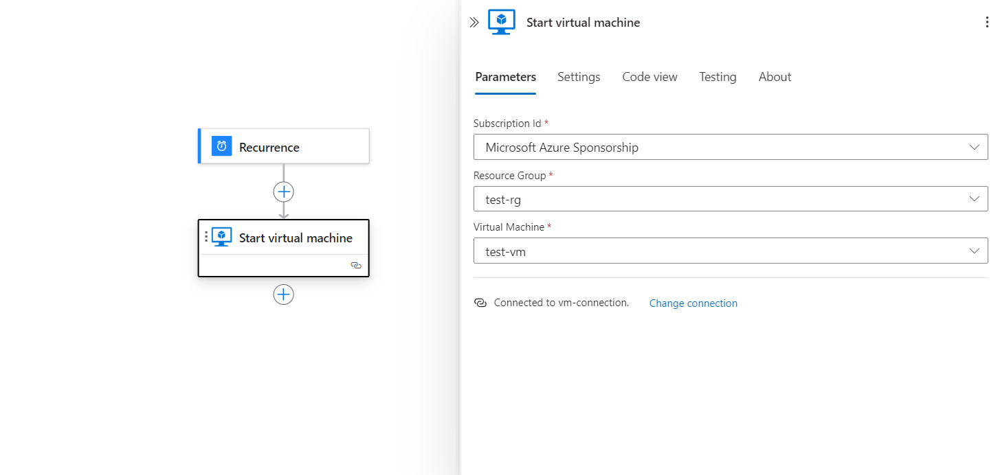
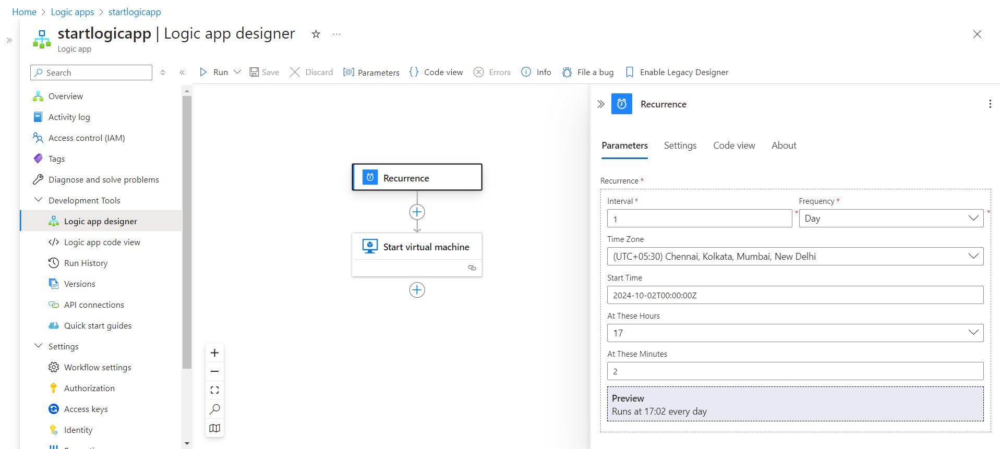

# Azure Logic App: Automating VM Start and Stop Based on a Schedule

## Overview

This guide explains how to create an Azure Logic App to automatically **stop** and **start** a Virtual Machine (VM) on a predefined schedule using the Azure portal and API connections. It also covers how to create a new API connection using **Service Principal Authentication** if you don't already have one.

## Prerequisites

Before creating the Logic App, ensure the following prerequisites are met:

- **Azure Subscription**: You need an active Azure subscription.
- **Azure Virtual Machine (VM)**: The VM that you want to automate for start and stop actions should be already deployed.
- **Service Principal with Access to VM**: Ensure you have a service principal with appropriate permissions to manage the VM (start and stop).
- **Azure Logic App**: Ensure you are familiar with how to create and deploy a Logic App in the Azure portal.

## Steps to Create the Logic App

### 1. **Create a Logic App**

1. Go to the [Azure Portal](https://portal.azure.com/).
2. Navigate to **Logic Apps** and click on **+ Create**.
3. Choose **Consumption Plan** for this scenario as it provides the `Recurrence` trigger.
4. Define the resource group and name for the Logic App.
5. Click **Create**.

### 2. **Create a New API Connection Using Service Principal**

To control the Azure VM (power off and start), you need an API connection. If you don’t have one already, follow these steps to create a new API connection using **Service Principal Authentication**.

#### Step 1: Create a Service Principal

1. Open the [Azure Cloud Shell](https://shell.azure.com/) or use the Azure CLI on your local machine.
2. Run the following command to create a service principal and assign it the required permissions:

```bash
az ad sp create-for-rbac --name <service-principal-name> --role contributor --scopes /subscriptions/<your-subscription-id>
```

This command will output the following details, which you will need:
- **App ID** (also referred to as Client ID)
- **Password** (also referred to as Client Secret)
- **Tenant ID**

#### Step 2: Create an API Connection in the Logic App

1. In the Logic App Designer, click on **New Step**.
2. Search for **Azure Virtual Machines** and select **Power Off a Virtual Machine**.
3. If you do not already have an API connection, you’ll be prompted to create one.
4. Select **Create Connection** and choose **Service Principal Authentication**.
5. Fill in the following details from the service principal you created:
   - **Client ID**: The **App ID** from the service principal.
   - **Client Secret**: The **Password** from the service principal.
   - **Tenant ID**: The **Tenant ID** from the service principal.
   - **Subscription**: Choose the subscription where your VM is located.
6. Click **Create** to finalize the API connection.



### 3. **Configure the Logic App**

Once the API connection is created, proceed with configuring the Logic App.

#### Step 1: Add the Recurrence Trigger

1. In the Logic App Designer, click **Add Trigger**.
2. Search for the **Recurrence** trigger and select it under the **Schedule** category.
3. Configure the recurrence trigger with the following settings:
   - **Frequency**: Day
   - **Interval**: 1
   - **Timezone**: India Standard Time (or your preferred timezone)
   - **Start Time**: The exact time when the automation should start (e.g., `2024-10-02T00:00:00Z`).
   - **Schedule**:
     - **Hour**: 16 (4:00 PM)
     - **Minute**: 40 (for 4:40 PM execution)

```json
{
  "triggers": {
    "Recurrence": {
      "type": "Recurrence",
      "recurrence": {
        "interval": 1,
        "frequency": "Day",
        "timeZone": "India Standard Time",
        "schedule": {
          "hours": [
            "16"
          ],
          "minutes": [
            40
          ]
        },
        "startTime": "2024-10-02T00:00:00Z"
      }
    }
  }
}
```



#### Step 2: Add Action to Stop the Virtual Machine

1. After adding the recurrence trigger, click **New Step**.
2. Search for **Azure Virtual Machines - Power Off** and select it.
3. Choose the API connection you created.
4. Configure the action:
   - **Subscription**: Choose your Azure subscription.
   - **Resource Group**: Select the resource group where the VM is located.
   - **Virtual Machine Name**: Select or specify the name of the VM to power off.

```json
{
  "actions": {
    "Power_off_virtual_machine": {
      "type": "ApiConnection",
      "inputs": {
        "host": {
          "connection": {
            "name": "@parameters('$connections')['azurevm']['connectionId']"
          }
        },
        "method": "post",
        "path": "/subscriptions/@{encodeURIComponent('<subscription-id>')}/resourcegroups/@{encodeURIComponent('<resource-group>')}/providers/Microsoft.Compute/virtualMachines/@{encodeURIComponent('<vm-name>')}/powerOff",
        "queries": {
          "api-version": "2019-12-01"
        }
      }
    }
  }
}
```



---

### 3. **Create Logic App to Start the VM**

#### Step 1: Create a Logic App

You may follow similar steps mentioned earlier to create a new logic app.

#### Step 2: Add Recurrence Trigger

1. In the Logic App Designer, click **Add Trigger**.
2. Search for **Recurrence** under the **Schedule** category and select it.
3. Configure the recurrence trigger with the following settings:
   - **Frequency**: Day
   - **Interval**: 1
   - **Timezone**: India Standard Time (or your preferred timezone)
   - **Start Time**: Set the exact time (e.g., 7:00 AM IST).
   - **Schedule**:
     - **Hour**: 7
     - **Minute**: 0

Example configuration:

```json
{
  "triggers": {
    "Recurrence": {
      "type": "Recurrence",
      "recurrence": {
        "interval": 1,
        "frequency": "Day",
        "timeZone": "India Standard Time",
        "schedule": {
          "hours": [
            "7"
          ],
          "minutes": [
            0
          ]
        },
        "startTime": "2024-10-03T01:30:00Z"
      }
    }
  }
}
```


#### Step 3: Create an API Connection in the Logic App

1. In the Logic App Designer, click on **New Step**.
2. Search for **Azure Virtual Machines** and select **Power Off a Virtual Machine**.
3. If you do not already have an API connection, you’ll be prompted to create one.
4. Select **Create Connection** and choose **Service Principal Authentication**.
5. Fill in the following details from the service principal you created:
   - **Client ID**: The **App ID** from the service principal.
   - **Client Secret**: The **Password** from the service principal.
   - **Tenant ID**: The **Tenant ID** from the service principal.
   - **Subscription**: Choose the subscription where your VM is located.
6. Click **Create** to finalize the API connection.

#### Step 4: Add Action to Start the Virtual Machine

1. Click **New Step** after the recurrence trigger.
2. Search for **Azure Virtual Machines - Start** and select it.
3. Choose the API connection you created.
4. Configure the action:
   - **Subscription**: Choose your Azure subscription.
   - **Resource Group**: Select the resource group where the VM is located.
   - **Virtual Machine Name**: Select or specify the name of the VM to start.

```json
{
  "actions": {
    "Start_virtual_machine": {
      "type": "ApiConnection",
      "inputs": {
        "host": {
          "connection": {
            "name": "@parameters('$connections')['azurevm']['connectionId']"
          }
        },
        "method": "post",
        "path": "/subscriptions/@{encodeURIComponent('<subscription-id>')}/resourcegroups/@{encodeURIComponent('<resource-group>')}/providers/Microsoft.Compute/virtualMachines/@{encodeURIComponent('<vm-name>')}/start",
        "queries": {
          "api-version": "2019-12-01"
        }
      }
    }
  }
}
```

## Conclusion

With these two separate Logic Apps, your Azure Virtual Machine will automatically stop and start at predefined times each day. You can modify the recurrence triggers to suit different schedules and control other Azure resources in a similar way by using Logic Apps and API connections.

Here is the final, updated documentation that includes steps for creating a separate Logic App to start the VM at a specified time.

---

# Azure Logic App: Automating VM Start and Stop Based on a Schedule

## Overview

This guide explains how to create two separate Azure Logic Apps to automatically **stop** and **start** a Virtual Machine (VM) on a predefined schedule using the Azure portal and API connections. It also covers how to create a new API connection using **Service Principal Authentication** if you don't already have one.

## Prerequisites

Before creating the Logic Apps, ensure the following prerequisites are met:

- **Azure Subscription**: You need an active Azure subscription.
- **Azure Virtual Machine (VM)**: The VM that you want to automate for start and stop actions should be already deployed.
- **Service Principal with Access to VM**: Ensure you have a service principal with appropriate permissions to manage the VM (start and stop).
- **Azure Logic App**: Ensure you are familiar with how to create and deploy a Logic App in the Azure portal.

## Steps to Create the Logic Apps

### 1. **Create a New API Connection Using Service Principal**

To control the Azure VM (power off and start), you need an API connection. If you don’t have one already, follow these steps to create a new API connection using **Service Principal Authentication**.

#### Step 1: Create a Service Principal

1. Open the [Azure Cloud Shell](https://shell.azure.com/) or use the Azure CLI on your local machine.
2. Run the following command to create a service principal and assign it the required permissions:

```bash
az ad sp create-for-rbac --name <service-principal-name> --role contributor --scopes /subscriptions/<your-subscription-id>
```

This command will output the following details, which you will need:
- **App ID** (also referred to as Client ID)
- **Password** (also referred to as Client Secret)
- **Tenant ID**

#### Step 2: Create an API Connection in the Logic App

1. In the Logic App Designer, click on **New Step**.
2. Search for **Azure Virtual Machines** and select **Power Off a Virtual Machine** or **Start a Virtual Machine** depending on the operation.
3. If you do not already have an API connection, you’ll be prompted to create one.
4. Select **Create Connection** and choose **Service Principal Authentication**.
5. Fill in the following details from the service principal you created:
   - **Client ID**: The **App ID** from the service principal.
   - **Client Secret**: The **Password** from the service principal.
   - **Tenant ID**: The **Tenant ID** from the service principal.
   - **Subscription**: Choose the subscription where your VM is located.
6. Click **Create** to finalize the API connection.

---

### 2. **Create Logic App to Stop the VM**

#### Step 1: Create a Logic App

1. Go to the [Azure Portal](https://portal.azure.com/).
2. Navigate to **Logic Apps** and click on **+ Create**.
3. Choose **Consumption Plan** for this scenario as it provides the `Recurrence` trigger.
4. Define the resource group and name for the Logic App (e.g., `Stop-VM-LogicApp`).
5. Click **Create**.

#### Step 2: Add Recurrence Trigger

1. In the Logic App Designer, click **Add Trigger**.
2. Search for **Recurrence** under the **Schedule** category and select it.
3. Configure the recurrence trigger with the following settings:
   - **Frequency**: Day
   - **Interval**: 1
   - **Timezone**: India Standard Time (or your preferred timezone)
   - **Start Time**: Set the exact time (e.g., `2024-10-02T00:00:00Z` for a daily 4:40 PM execution).
   - **Schedule**:
     - **Hour**: 16 (4:00 PM)
     - **Minute**: 40

Example configuration:

```json
{
  "triggers": {
    "Recurrence": {
      "type": "Recurrence",
      "recurrence": {
        "interval": 1,
        "frequency": "Day",
        "timeZone": "India Standard Time",
        "schedule": {
          "hours": [
            "16"
          ],
          "minutes": [
            40
          ]
        },
        "startTime": "2024-10-02T00:00:00Z"
      }
    }
  }
}
```

#### Step 3: Add Action to Stop the Virtual Machine

1. After adding the recurrence trigger, click **New Step**.
2. Search for **Azure Virtual Machines - Power Off** and select it.
3. Choose the API connection you created.
4. Configure the action:
   - **Subscription**: Choose your Azure subscription.
   - **Resource Group**: Select the resource group where the VM is located.
   - **Virtual Machine Name**: Select or specify the name of the VM to power off.

```json
{
  "actions": {
    "Power_off_virtual_machine": {
      "type": "ApiConnection",
      "inputs": {
        "host": {
          "connection": {
            "name": "@parameters('$connections')['azurevm']['connectionId']"
          }
        },
        "method": "post",
        "path": "/subscriptions/@{encodeURIComponent('<subscription-id>')}/resourcegroups/@{encodeURIComponent('<resource-group>')}/providers/Microsoft.Compute/virtualMachines/@{encodeURIComponent('<vm-name>')}/powerOff",
        "queries": {
          "api-version": "2019-12-01"
        }
      }
    }
  }
}
```

#### Step 4: Save and Test the Logic App

- Click **Save** and manually test the Logic App by clicking **Run Trigger** to verify the VM powers off as expected.


---

